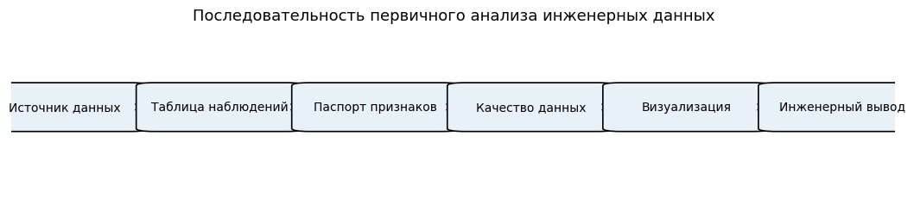
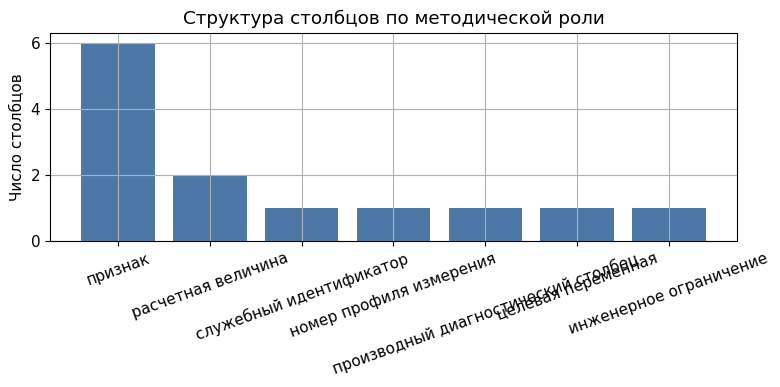
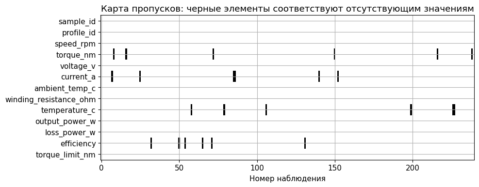
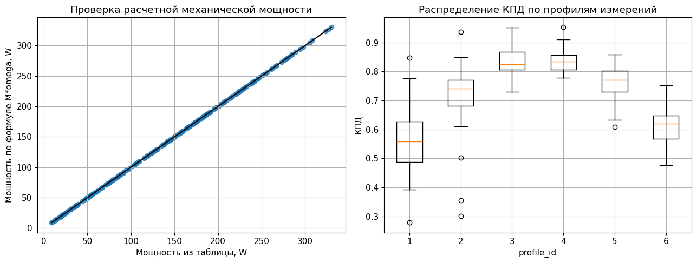
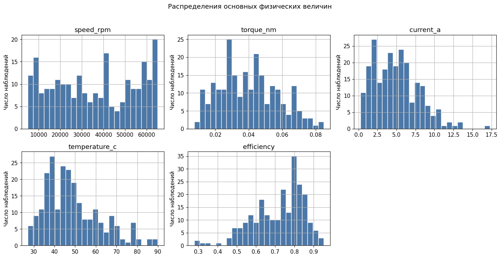
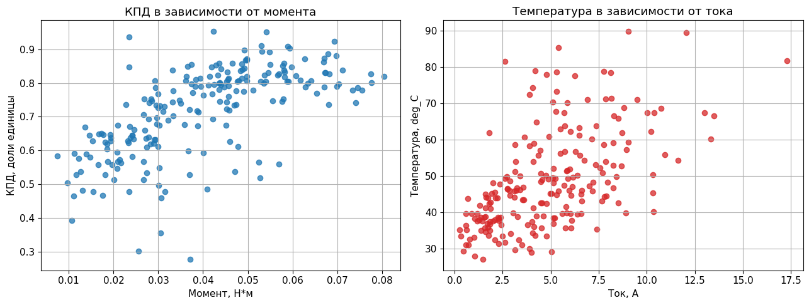
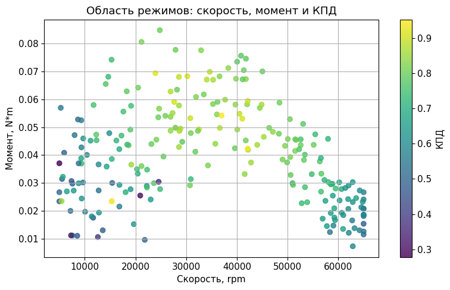
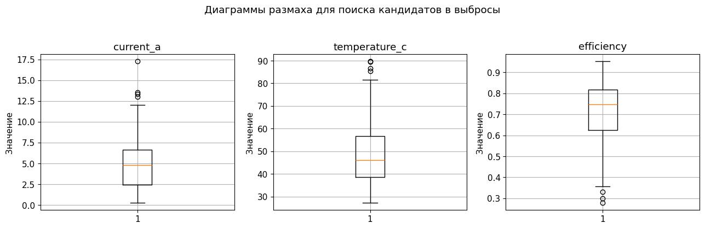
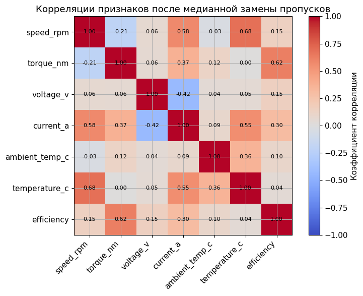

<!-- _class: title -->

# Занятие 1
## Инженерные данные и постановка задачи прикладного искусственного интеллекта

Магистратура. Прикладной искусственный интеллект.
Продолжительность: два академических часа (90 минут).
Инженерный кейс: маломощный высокооборотный электромеханический преобразователь на постоянных магнитах (англ. Permanent Magnet Synchronous Motor, далее PMSM).

<!--
Открытие курса. Преподаватель представляет дисциплину, формат зачёта
(зачтено, частично зачтено, не зачтено), общую структуру из 12 занятий
и подчёркивает, что курс построен на инженерных кейсах, близких к
тематикам магистерских исследований студентов. Целесообразно собрать
короткие реплики студентов о темах их работ: это пригодится при
формировании групп и распределении кейсов в занятии 12.
-->

---

## Тематика занятия

Занятие посвящено первому из двух методических этапов прикладного
анализа данных: формализации задачи и предварительному анализу
исходной выборки.

Изучаются:

1. структура инженерного набора данных (англ. dataset, набор данных);
2. содержательные понятия признака и целевой переменной;
3. процедура первичного анализа (англ. exploratory data analysis, EDA);
4. контроль физической реализуемости измерений и расчётных величин.

<!--
Аудиторное правило: каждая работа должна завершаться в конце пары.
Домашняя доработка не предусматривается. Это означает, что весь
объём работы должен укладываться в 45 минут активной работы группы.
-->

---

## Цель занятия

Сформировать у магистранта умение видеть инженерный смысл в наборе
данных: различать измеряемые признаки и расчётные диагностические
столбцы, идентифицировать целевую переменную, выявлять пропуски и
выбросы, формулировать обоснованный инженерный вывод о пригодности
данных для последующего моделирования.

<!--
Цель формулируется в первой части аудиторного отчёта. Студент должен
переписать цель своими словами. Это закрепляет навык формулировки
постановки задачи, который пригодится в занятии 12 при работе с LLM.
-->

---

## Задачи занятия

1. Освоить понятия признака, целевой переменной, наблюдения, шума, выброса и пропуска.
2. Выполнить загрузку и просмотр учебного набора данных.
3. Идентифицировать признаки и целевую переменную.
4. Обнаружить пропуски и выбросы по правилу межквартильного размаха.
5. Применить медианную замену пропусков с физическим ограничением.
6. Построить не менее двух графиков парных зависимостей.
7. Сформулировать индивидуальный инженерный вывод о значимости признаков.

---

## Распределение времени занятия

| Блок | Содержание | Время, мин |
|---|---|---|
| 1 | Теоретическое введение | 15 |
| 2 | Демонстрация структуры данных и шаблона кода | 10 |
| 3 | Самостоятельная работа группами | 45 |
| 4 | Обсуждение результатов и типовых ошибок | 10 |
| 5 | Оформление краткого аудиторного отчёта | 10 |

<!--
Тайминг согласован с разделом 5 рабочей программы (docs/PLAN.md).
Преподаватель удерживает его жёстко: каждый блок не более указанного
времени, иначе студенты не успевают написать отчёт.
-->

---

<!-- _class: section -->

# Раздел 1
## Постановка задачи первичного анализа данных

---

## Содержательная постановка задачи

Имеется учебный набор данных, описывающий установившиеся
режимы работы маломощного высокооборотного PMSM. Каждое наблюдение
содержит измеряемые электрические и тепловые величины, а также
расчётные диагностические столбцы.

Требуется до построения какой-либо модели машинного обучения
(англ. Machine Learning, ML):

1. установить структуру набора данных;
2. оценить качество исходных измерений;
3. сформулировать рекомендации по дальнейшему использованию данных
   в задачах регрессии (занятие 2) и классификации (занятие 3).

<!--
Содержательная постановка отвечает на вопрос: «зачем мы это делаем?».
Формальная постановка (следующий слайд) отвечает на вопрос: «что
конкретно мы вычисляем?». Оба уровня обязательны для научного отчёта.
-->

---

## Формальная постановка задачи

Дано:

$$
\mathcal{D} = \{ \mathbf{z}_i \}_{i=1}^{N}, \qquad
\mathbf{z}_i = (x_{i,1}, x_{i,2}, \ldots, x_{i,p}, y_i),
$$

где $\mathbf{z}_i$ - $i$-е наблюдение (одна строка таблицы),
$x_{i,j}$ - значение $j$-го признака,
$y_i$ - значение целевой переменной,
$N$ - число наблюдений, $p$ - число признаков.

Требуется построить:

1. множество измеряемых признаков $\mathcal{F}_\text{meas} \subseteq \{1, \ldots, p\}$;
2. множество диагностических столбцов $\mathcal{F}_\text{diag}$, исключаемых из дальнейшего обучения;
3. множества индексов пропусков $\mathcal{M} \subset \{1, \ldots, N\}$ и выбросов $\mathcal{O} \subset \{1, \ldots, N\}$;
4. правило восстановления пропусков $\hat{x}_{i,j} = g(x_{i,j}, \theta)$ с физическим ограничением.

<!--
Формальная запись закрепляет научный стиль. Студент должен
переписать постановку в свой отчёт. В занятиях 2 и 3 эта запись
будет расширена соответствующими функционалами потерь.
-->

---

## Ограничения и допущения

Физические ограничения для маломощного PMSM:

$$
0 < n_i \leq n_\text{max}, \quad
0 < M_i \leq M_\text{max}(n_i), \quad
T_\text{amb} \leq T_i \leq T_\text{max},
$$

$$
0 \leq \eta_i \leq 1, \qquad
P_{\text{out},i} = M_i \omega_i, \qquad
P_{\text{in},i} = U_i I_i,
$$

где $n$ - частота вращения (об/мин),
$\omega = 2\pi n / 60$ - угловая скорость (рад/с),
$M$ - электромагнитный момент,
$T$ - температура обмотки,
$\eta = P_\text{out} / P_\text{in}$ - коэффициент полезного действия,
$U$ и $I$ - напряжение и ток.

<!--
Эти неравенства задают допустимую область значений. Их нарушение
после восстановления пропусков означает методическую ошибку. К ним
вернёмся при контроле физической реализуемости.
-->

---

<!-- _class: section -->

# Раздел 2
## Теоретическое введение

---

## Искусственный интеллект и машинное обучение

Искусственный интеллект (англ. Artificial Intelligence, далее AI) -
совокупность методов, позволяющих извлекать закономерности из данных,
строить прогнозные модели и поддерживать принятие технических решений.

Машинное обучение (англ. Machine Learning, ML) - раздел AI, в котором
алгоритм строит зависимость между входными признаками и выходной
величиной по примерам, а не по заранее заданной аналитической формуле.

В курсе AI рассматривается как инструмент инженера, дополняющий, но не
заменяющий физико-математическую модель объекта.

<!--
Студенты часто отождествляют AI с генеративными моделями. Уточняем:
большинство методов курса (регрессия, классификация, кластеризация,
оптимизация) относятся к классическому ML и являются разделом AI.
-->

---

## Базовые термины

| Термин | Английский эквивалент | Определение |
|---|---|---|
| Наблюдение | observation | Одна строка таблицы; один режим работы объекта |
| Признак | feature | Входная величина, используемая моделью |
| Целевая переменная | target variable | Величина, которую требуется предсказать |
| Шум | noise | Случайная составляющая измерения |
| Выброс | outlier | Наблюдение, резко отличающееся от остальных |
| Пропуск | missing value | Отсутствующее значение в одной из колонок |

<!--
Термин «выброс» особенно важен. В инженерной задаче он может
соответствовать реальному редкому режиму, а не ошибке измерения.
Автоматическое удаление выбросов без инженерного анализа недопустимо.
-->

---

## Физическая модель учебного кейса

Маломощный высокооборотный PMSM, установившийся режим:

$$
P_\text{out} = M \, \omega, \qquad
P_\text{in} = U \, I,
$$

$$
\eta = \frac{P_\text{out}}{P_\text{in}} = \frac{M \, \omega}{U \, I},
\qquad
P_\text{loss} = P_\text{in} - P_\text{out}.
$$

Эти соотношения справедливы для усреднённых по периоду величин и
используются как референсный физический контроль при оценке качества
данных.

<!--
Группа формул повторяется в занятиях 2 и 3. Подчеркнуть: P_out и
P_loss - расчётные величины, а не результаты прямого измерения.
Их использование как входных признаков ML-модели приведёт к
методической утечке данных (см. занятия 2 и 3).
-->

---

## Зависимость сопротивления обмотки от температуры

Сопротивление обмотки фазной катушки моделируется выражением:

$$
R(T) = R_0 \bigl[ 1 + \alpha \, (T - T_0) \bigr],
$$

где $R_0$ - сопротивление при опорной температуре $T_0$,
$\alpha$ - температурный коэффициент сопротивления (для меди
$\alpha \approx 3{,}9 \cdot 10^{-3}$ К$^{-1}$),
$T$ - текущая температура обмотки.

Этот закон используется в диагностическом столбце
`winding_resistance_ohm` и помогает оценить теплопотери в меди:
$P_\text{Cu} = I^2 \, R(T)$.

<!--
В занятиях 4 и 5 формула R(T) будет применена для прогноза
теплового режима PMSM при работе в составе высотной
псевдоспутниковой платформы (High-Altitude Platform System, HAPS).
-->

---

## Соответствие математических обозначений и столбцов CSV

| Обозначение | Столбец CSV | Методическая роль |
|---|---|---|
| $n$ | `speed_rpm` | измеряемый признак |
| $M$ | `torque_nm` | измеряемый признак |
| $U$ | `voltage_v` | измеряемый признак |
| $I$ | `current_a` | признак; в занятии 2 источник утечки |
| $T_\text{amb}$ | `ambient_temp_c` | внешнее условие |
| $T$ | `temperature_c` | измеряемый признак |
| $R(T)$ | `winding_resistance_ohm` | производный диагностический столбец |
| $P_\text{out}$, $P_\text{loss}$ | `output_power_w`, `loss_power_w` | расчётные, исключаются из признаков |
| $\eta$ | `efficiency` | целевая переменная занятия 2 |

<!--
Эту таблицу студент переносит в краткий аудиторный отчёт. Особо
выделить три категории: измеряемые признаки, расчётные диагностические
столбцы, целевая переменная. Последние два пункта используются как
вход модели только при ошибочной постановке задачи (утечка данных).
-->

---

<!-- _class: section -->

# Раздел 3
## Математические инструменты первичного анализа

---

## Описательная статистика признаков

Для $j$-го признака вычисляются:

$$
\bar{x}_j = \frac{1}{N} \sum_{i=1}^{N} x_{i,j}, \qquad
s_j^2 = \frac{1}{N-1} \sum_{i=1}^{N} (x_{i,j} - \bar{x}_j)^2,
$$

а также квантили $Q_p(x_j)$ при $p \in \{0{,}25;\ 0{,}50;\ 0{,}75\}$.

Эти величины образуют паспорт набора данных: они позволяют судить
о диапазоне, центральной тенденции и разбросе каждой величины
без обращения к графикам.

<!--
В блокноте паспорт реализуется вызовом df.describe(). Студент должен
интерпретировать его инженерно: достаточен ли диапазон, не противоречат
ли значения номинальным паспортным данным двигателя.
-->

---

## Коэффициент линейной корреляции Пирсона

Линейная связь признака $x_j$ и целевой переменной $y$ оценивается
коэффициентом корреляции Пирсона:

$$
r_{x_j, y} = \frac{ \displaystyle \sum_{i=1}^{N} (x_{i,j} - \bar{x}_j)(y_i - \bar{y}) }
{ \sqrt{ \displaystyle \sum_{i=1}^{N} (x_{i,j} - \bar{x}_j)^2 } \cdot
  \sqrt{ \displaystyle \sum_{i=1}^{N} (y_i - \bar{y})^2 } }.
$$

Значения: $r \in [-1; +1]$, где $|r|$ ближе к единице указывает на
сильную линейную связь.

Важно: высокое значение $|r|$ не доказывает причинно-следственную
зависимость; нелинейная связь может оставаться при $r \approx 0$.

<!--
Эта оговорка повторяется в типовых ошибках занятия. Корреляция
обнаруживает только линейный фрагмент связи. Полезный приём:
строить scatter plot одновременно с расчётом r.
-->

---

## Метод межквартильного размаха для поиска выбросов

Межквартильный размах (англ. Interquartile Range, IQR):

$$
\mathrm{IQR}(x_j) = Q_3(x_j) - Q_1(x_j),
$$

где $Q_1$ и $Q_3$ - первый и третий квартили.

Наблюдение $x_{i,j}$ относится к множеству кандидатов в выбросы $\mathcal{O}_j$, если:

$$
x_{i,j} \notin \bigl[\, Q_1 - 1{,}5 \cdot \mathrm{IQR}; \ Q_3 + 1{,}5 \cdot \mathrm{IQR} \,\bigr].
$$

Метод носит вспомогательный характер. Окончательное решение об
удалении выброса принимается после инженерной проверки физической
правдоподобности.

<!--
Множитель 1.5 - стандартное правило Тьюки. Расширенный множитель 3.0
выделяет крайние выбросы. В курсе используем 1.5; альтернативу
обсуждаем при необходимости.
-->

---

## Восстановление пропусков с физическим ограничением

Простая медианная замена:

$$
\hat{x}_{i,j} = \mathrm{median}\bigl( \{ x_{k,j} : k \notin \mathcal{M}_j \} \bigr).
$$

Физически ограниченная медианная замена использует энергетическое
тождество. Для момента $M$ при заполнении пропуска применяется:

$$
\hat{M}_i = \min\!\left( \mathrm{median}(M), \ \dfrac{0{,}98 \cdot U_i \, I_i}{\omega_i} \right),
$$

что не допускает $\eta > 0{,}98$ после восстановления.

<!--
Это методическое решение реализовано в src/appai_lab/data_generators.py
и в студенческом блокноте. Простая медиана может создать строки с
КПД больше единицы, что нарушает физический закон сохранения энергии.
-->

---

<!-- _class: section -->

# Раздел 4
## Демонстрация шаблона работы

---

## Структура занятия в репозитории

```
notebooks/student/01_engineering_data_student.ipynb
notebooks/teacher/01_engineering_data_teacher.ipynb
data/processed/practice_01_motor_measurements.csv
docs/teacher_guides/01_engineering_data_teacher_guide.md
docs/templates/practice_report_template.md
```

В среде Google Colab первая ячейка блокнота
`COLAB_BOOTSTRAP_APPailab` устанавливает зависимости и клонирует
репозиторий. В локальном окружении предварительно выполняется
`pip install -r requirements-base.txt`.

<!--
Перед демонстрацией убедиться, что Colab-ссылки в README репозитория
открываются. Показать студентам рабочий процесс «открыть блокнот;
выполнить ячейки до первого TODO; остановиться» в течение 2-3 минут.
-->

---

## Технологический процесс анализа данных



<!--
Диаграмма обобщает структуру блокнота. Блоки 4-6 соответствуют
аудиторной работе группы. Блок 7 (инженерный вывод) заполняется
в шаблоне отчёта, предусмотренном в docs/templates.
-->

---

## Описание столбцов учебного набора



<!--
Таблица column_description группирует столбцы по ролям: измеряемые
признаки, диагностические столбцы, целевые переменные. Студенты
переносят таблицу в раздел «Описание исходных данных» аудиторного
отчёта.
-->

---

<!-- _class: section -->

# Раздел 5
## Практическое задание

---

## Восемь шагов работы группы

1. Загрузить файл `practice_01_motor_measurements.csv`.
2. Просмотреть первые строки и сводный паспорт `df.info()`.
3. Заполнить список `feature_columns` без расчётных столбцов.
4. Обнаружить пропуски и кандидатов в выбросы методом IQR.
5. Применить медианную замену с физическим ограничением.
6. Построить парные зависимости $\eta = f(M)$ и $T = f(I)$.
7. Заполнить таблицу описательной статистики.
8. Сформулировать индивидуальный инженерный вывод о значимости признаков.

<!--
Преподаватель проходит по группам после шага 4. Самая частая
методическая ошибка - автоматическое удаление выбросов через IQR
без обсуждения физической природы. Напомнить: выброс не равняется
ошибке измерения.
-->

---

## Стратегия обработки пропусков



<!--
В учебном наборе намеренно содержится по шесть пропусков в torque_nm,
current_a, temperature_c и efficiency. Студенты сопоставляют две
стратегии: удаление строк и медианная замена. Выбор стратегии
обосновывается в инженерном выводе.
-->

---

## Контроль физической реализуемости



<!--
Контроль восстановленных значений по неравенствам предметной области:
0 < eta <= 1; P_out не должна превышать P_in. Это сильный методический
инструмент. Студент видит, что данные обязаны подчиняться физике,
а не только статистическому правилу заполнения пропусков.
-->

---

## Первичная описательная статистика



<!--
Гистограммы признаков. Особое внимание - хвостам распределений
current_a и temperature_c: именно из них впоследствии будут выделены
кандидаты в выбросы.
-->

---

## Парные зависимости: КПД от момента и температура от тока



<!--
Два обязательных графика согласно PLAN.md (раздел 7, занятие 1).
Студент видит, что КПД падает в крайних режимах нагрузки, а температура
монотонно растёт с током. Здесь же ставится принципиальный вопрос:
коррелирует - не значит «причинно обусловлено».
-->

---

## Парные зависимости: скорость и момент в режимах с разным КПД



<!--
Диаграмма рассеяния speed_rpm-torque_nm с цветовой шкалой эффективности.
Видна область наиболее эффективных режимов в средней части
номинального диапазона. Это подсказка к занятию 2: модель регрессии
будет приближать именно эту функциональную зависимость.
-->

---

## Поиск кандидатов в выбросы по методу IQR



<!--
Box-plot и таблица числа кандидатов. Перед удалением каждый кандидат
сверяется с физическим смыслом. Пример: всплеск тока, совпадающий
с пиковым моментом, не является ошибкой измерения. Это реальный
краткосрочный режим перегрузки.
-->

---

<!-- _class: warning -->

## Антипример. Медианная замена без физического контроля



> Простая медианная замена приводит к появлению строк с $\eta > 1$,
> что противоречит закону сохранения энергии. Восстановление
> обязательно должно учитывать энергетическое тождество
> $\eta = M\omega / (U I)$.

<!--
Это методически важный антипример. Если студент применит медианную
замену в одну строку кода (например, df.fillna(df.median())), он
получит данные, нарушающие физику. Реализация в репозитории
использует физически ограниченную медиану с предельным значением 0.98.
-->

---

## Типовые методические ошибки занятия

1. Отождествление корреляции с причинно-следственной связью.
2. Игнорирование размерности величин (об/мин против рад/с; градусы Цельсия против кельвинов).
3. Удаление выбросов без проверки их физической природы.
4. Использование расчётных столбцов как признаков.
5. Формальный текстовый вывод без обращения к физической модели.

<!--
Список соответствует PLAN.md раздел 7, занятие 1. К каждой ошибке
рекомендуется привести пример из аудиторной практики прошлых лет
или из самого блокнота, чтобы студент мог соотнести с конкретным
действием.
-->

---

<!-- _class: checklist -->

## Критерии зачёта

1. Данные загружены, признаки и целевая переменная определены.
2. Пропуски и выбросы обнаружены и обработаны обоснованно.
3. Построены не менее двух графиков парных зависимостей.
4. Сформулирован инженерный вывод о значимости признаков.
5. Каждый участник группы написал индивидуальный вывод.
6. Студент отвечает не менее чем на три из пяти контрольных вопросов.

Качественная шкала: зачтено; частично зачтено; не зачтено.

<!--
Если индивидуальный вывод отсутствует, автоматически выставляется
«частично зачтено» независимо от качества графиков и таблиц.
Это методическая жёсткость, согласованная с PLAN.md.
-->

---

## Контрольные вопросы

1. Что называется признаком в задаче машинного обучения?
2. Что называется целевой переменной?
3. Почему выброс в данных не всегда является ошибкой измерения?
4. Почему КПД электромеханического преобразователя нельзя анализировать без учёта режима работы?
5. Какие признаки могут быть физически связаны с потерями в электрической машине?

<!--
Вопросы задаются устно при защите аудиторного отчёта. Двух
правильных ответов достаточно для зачёта. Полное отсутствие
ответов на все пять переводит работу в категорию «не зачтено».
-->

---

## Связь с занятиями 2 и 3

Занятие 2: те же измерения используются как обучающая выборка для
регрессии КПД. Ток `current_a` будет исключён из признаков как
источник косвенной утечки.

Занятие 3: дополнительный учебный набор используется для классификации
режимов на допустимые и недопустимые. Понимание выбросов и
физических ограничений критично для корректной разметки класса
«недопустимый режим».

<!--
Создание ожидания и сквозной логики. Полезно произнести: «при
подготовке к занятию 2 распечатайте аудиторный отчёт по занятию 1,
он понадобится для уточнения признаков».
-->

---

## Реестр научно-методических источников


<!--
К базовой учебной выборке привязаны открытые внешние наборы данных
(Zenodo Electric Motor Temperature, Zenodo PMSM inverter fault,
Mendeley EV powertrain efficiency). Они описаны в
docs/sources/dataset_assignment_details.md и используются в
расширенных блокнотах notebooks/external. Сильным студентам можно
предложить эти наборы как материал для проектной работы.
-->

---

<!-- _class: section -->

# Итог занятия 1

Инженерные данные представляют собой объединение физических
зависимостей и статистической изменчивости.
Выбор признаков выполняется по физическому смыслу, а не по
численной величине корреляции.
Решение об удалении выбросов принимает инженер, а не алгоритм.

<!--
Заключительный слайд. Если осталось время в блоке обсуждения,
полезно попросить две-три группы озвучить свой инженерный вывод.
Это отрабатывает навык формулировки, который пригодится во всех
последующих занятиях.
-->
