<!-- _class: title -->

# Занятие 2
## Линейная и полиномиальная регрессия для оценки коэффициента полезного действия

Магистратура. Прикладной искусственный интеллект.
Продолжительность: два академических часа (90 минут).
Инженерный кейс: маломощный высокооборотный электромеханический преобразователь на постоянных магнитах (англ. Permanent Magnet Synchronous Motor, далее PMSM).

<!--
Преподаватель напоминает выводы занятия 1: те же измерения используются
как обучающая выборка для регрессии КПД. Главная методическая идея
текущего занятия - понятие утечки данных (англ. data leakage) и
её влияние на инженерную интерпретацию результата.
-->

---

## Тематика занятия

Занятие посвящено задаче регрессионного моделирования непрерывной
инженерной величины: коэффициента полезного действия (далее КПД)
электромеханического преобразователя.

Изучаются:

1. линейная и полиномиальная регрессионные модели;
2. метод наименьших квадратов (англ. Ordinary Least Squares, OLS);
3. гребневая регрессия (англ. Ridge regression) как пример L2-регуляризации;
4. метрики качества регрессии: средняя абсолютная ошибка, корень из средней квадратичной ошибки, коэффициент детерминации;
5. понятие утечки данных и её распознавание по структуре признаков.

---

## Цель занятия

Сформировать у магистранта умение строить и критически оценивать
регрессионные модели непрерывных инженерных параметров: подбирать
признаки с учётом физических ограничений, обучать линейную и
полиномиальную модели, рассчитывать и инженерно интерпретировать
метрики качества, распознавать утечку данных через косвенные
признаки.

<!--
Цель формулируется в первой части аудиторного отчёта. Студент
переписывает её своими словами и связывает с конкретной задачей
оценки КПД для маломощного PMSM.
-->

---

## Задачи занятия

1. Сформулировать математическую постановку задачи регрессии.
2. Подготовить признаки с учётом исключения утечки данных.
3. Разделить выборку на обучающую и тестовую части.
4. Обучить линейную модель методом наименьших квадратов.
5. Обучить полиномиальную модель второй степени с гребневой регуляризацией.
6. Рассчитать MAE, RMSE и коэффициент детерминации на тестовой выборке.
7. Построить график соответствия прогноза и истинного значения, а также график остатков.
8. Сопоставить две модели и сформулировать вывод о применимости.

---

## Распределение времени занятия

| Блок | Содержание | Время, мин |
|---|---|---|
| 1 | Теоретическое введение | 15 |
| 2 | Демонстрация структуры данных и шаблона кода | 10 |
| 3 | Самостоятельная работа группами | 45 |
| 4 | Обсуждение результатов и типовых ошибок | 10 |
| 5 | Оформление краткого аудиторного отчёта | 10 |

---

<!-- _class: section -->

# Раздел 1
## Постановка задачи регрессии

---

## Содержательная постановка задачи

По набору измерений установившихся режимов работы PMSM требуется
построить функцию, которая по нескольким измеряемым параметрам
прогнозирует коэффициент полезного действия двигателя.

Прогноз должен быть достаточно точным для предварительной
инженерной оценки и одновременно быть свободным от методической
утечки информации, при которой целевая величина прямо или косвенно
вычисляется из признаков по физической формуле.

<!--
Принципиальное различие занятия 2 и стандартной учебной задачи в
учебниках по ML: здесь признаки нельзя выбирать только по
численной корреляции. Часть из них находится в энергетическом
тождестве с целевой величиной и должна быть исключена.
-->

---

## Формальная постановка задачи

Дано:

$$
\mathcal{D} = \{ (\mathbf{x}_i, y_i) \}_{i=1}^{N},
\quad
\mathbf{x}_i \in \mathbb{R}^{p}, \quad
y_i \in [0; 1],
$$

где $\mathbf{x}_i$ - вектор признаков $i$-го наблюдения,
$y_i = \eta_i$ - значение целевой переменной (КПД),
$N$ - объём выборки, $p$ - число признаков.

Требуется построить отображение $f_{\boldsymbol{\beta}}: \mathbb{R}^p \to \mathbb{R}$,
такое что:

$$
\boldsymbol{\beta}^{*} = \arg\min_{\boldsymbol{\beta}} \;
\mathbb{E}_{(\mathbf{x}, y) \sim \mathcal{P}} \bigl[ \, \ell\bigl(y, f_{\boldsymbol{\beta}}(\mathbf{x})\bigr) \,\bigr],
$$

где $\mathcal{P}$ - истинное распределение режимов работы,
$\ell$ - функция потерь, по умолчанию квадратичная.

<!--
Поскольку истинное распределение неизвестно, минимизация выполняется
эмпирически на обучающей выборке. Проверка обобщающей способности
проводится на отложенной тестовой выборке.
-->

---

## Допущения и ограничения постановки

1. Признаки $\mathbf{x}_i$ являются непосредственно измеряемыми величинами; расчётные диагностические столбцы исключаются.
2. Целевая переменная физически ограничена: $0 \leq \eta_i \leq 1$.
3. Ток $I$ и расчётные мощности $P_\text{out}$, $P_\text{loss}$ не используются как признаки во избежание утечки.
4. Распределение режимов в обучающей и тестовой выборках предполагается одинаковым.
5. Шум измерений считается аддитивным и приближённо нормальным.

Строгий набор признаков:

$$
\mathcal{F}_\text{strict} = \{\, n, \ M, \ U, \ T, \ T_\text{amb} \,\}.
$$

<!--
Допущения должны быть явно прописаны в научно-техническом отчёте.
Это формирует у магистранта культуру обоснования постановки задачи,
которая будет ключевой в занятии 12 при работе с LLM.
-->

---

<!-- _class: section -->

# Раздел 2
## Теоретическое введение

---

## Регрессия как отображение

Регрессия (англ. regression) - задача машинного обучения, в которой
требуется приблизить непрерывную величину $y$ как функцию от
вектора признаков $\mathbf{x}$.

В матричной форме обучающая выборка записывается как:

$$
\mathbf{X} = \begin{pmatrix} \mathbf{x}_1^{\top} \\ \vdots \\ \mathbf{x}_N^{\top} \end{pmatrix} \in \mathbb{R}^{N \times p},
\qquad
\mathbf{y} = (y_1, \ldots, y_N)^{\top} \in \mathbb{R}^{N}.
$$

Здесь $\mathbf{X}$ - матрица плана (англ. design matrix),
$\mathbf{y}$ - вектор откликов.

<!--
Матричная запись принципиально важна. Она позволяет получить
явное решение OLS и сформулировать регуляризацию как добавление
к обусловливающей матрице.
-->

---

## Линейная модель регрессии

Линейная регрессия задаётся уравнением:

$$
\hat{y}_i \;=\; \beta_0 + \sum_{j=1}^{p} \beta_j \, x_{i,j},
\qquad
\hat{\mathbf{y}} \;=\; \mathbf{X} \boldsymbol{\beta},
$$

где $\boldsymbol{\beta} = (\beta_0, \beta_1, \ldots, \beta_p)^{\top}$ -
вектор параметров модели.

В матрицу плана $\mathbf{X}$ предварительно добавляется столбец из
единиц, что соответствует свободному члену $\beta_0$.

<!--
Свободный член обеспечивает корректную работу модели при значениях
признаков, далёких от нуля. В инженерных данных абсолютные значения
обычно ненулевые.
-->

---

## Метод наименьших квадратов

Метод наименьших квадратов (OLS) выбирает вектор параметров,
минимизирующий сумму квадратов остатков:

$$
\boldsymbol{\beta}^{*}_\text{OLS} = \arg\min_{\boldsymbol{\beta}} \;
\bigl\| \mathbf{y} - \mathbf{X}\boldsymbol{\beta} \bigr\|_{2}^{2}
= \arg\min_{\boldsymbol{\beta}} \sum_{i=1}^{N} (y_i - \mathbf{x}_i^{\top} \boldsymbol{\beta})^2.
$$

При условии полного ранга матрицы $\mathbf{X}^{\top} \mathbf{X}$
решение задаётся нормальным уравнением:

$$
\boldsymbol{\beta}^{*}_\text{OLS} = ( \mathbf{X}^{\top} \mathbf{X} )^{-1} \, \mathbf{X}^{\top} \mathbf{y}.
$$

<!--
Нормальное уравнение - аналитическое решение. На практике обычно
используют QR-разложение или сингулярное разложение для численной
устойчивости. В шаблоне применяется реализация scikit-learn.
-->

---

## Гребневая регрессия и регуляризация

Гребневая регрессия (англ. Ridge regression) добавляет L2-штраф
на величину коэффициентов:

$$
\boldsymbol{\beta}^{*}_\text{Ridge} = \arg\min_{\boldsymbol{\beta}} \Bigl\{ \bigl\| \mathbf{y} - \mathbf{X}\boldsymbol{\beta} \bigr\|_{2}^{2} + \alpha \, \| \boldsymbol{\beta} \|_{2}^{2} \Bigr\},
$$

$$
\boldsymbol{\beta}^{*}_\text{Ridge} = ( \mathbf{X}^{\top} \mathbf{X} + \alpha \mathbf{I} )^{-1} \mathbf{X}^{\top} \mathbf{y}.
$$

При $\alpha = 0$ модель эквивалентна OLS.
Увеличение $\alpha$ уменьшает абсолютные значения коэффициентов и
противодействует переобучению, особенно при коллинеарности признаков.

<!--
Регуляризация - не магия. Она компенсирует риск переобучения,
когда число признаков сопоставимо с числом наблюдений или когда
признаки коррелированы. В шаблоне используется alpha = 1.0; в
самостоятельном эксперименте студент варьирует alpha в диапазоне
от 0.1 до 10.
-->

---

## Полиномиальная регрессия

Полиномиальная регрессия расширяет вектор признаков степенными
и смешанными мономами. Например, при степени $d = 2$ для двух
исходных признаков $x_1$, $x_2$ получаем:

$$
\boldsymbol{\varphi}(\mathbf{x}) = ( 1, \ x_1, \ x_2, \ x_1^2, \ x_1 x_2, \ x_2^2 )^{\top}.
$$

Число параметров модели растёт как биномиальный коэффициент
$\binom{p + d}{d}$. Полиномиальная регрессия второй степени с
гребневой регуляризацией обычно достаточна для аппроксимации
гладких характеристик электрических машин.

<!--
Характеристики PMSM нелинейны (зависимость КПД от нагрузки имеет
максимум в средней области). Полиномиальные признаки позволяют
аппроксимировать кривую без необходимости задавать аналитическую
форму.
-->

---

## Метрики качества регрессии

Средняя абсолютная ошибка (англ. Mean Absolute Error, MAE):

$$
\mathrm{MAE} = \frac{1}{N} \sum_{i=1}^{N} \bigl| y_i - \hat{y}_i \bigr|.
$$

Корень из средней квадратичной ошибки (англ. Root Mean Squared Error, RMSE):

$$
\mathrm{RMSE} = \sqrt{ \frac{1}{N} \sum_{i=1}^{N} ( y_i - \hat{y}_i )^2 }.
$$

MAE и RMSE выражаются в единицах целевой величины. В задаче оценки
КПД это доли единицы; при умножении на 100 они интерпретируются
как процентные пункты КПД. RMSE сильнее реагирует на крупные ошибки,
чем MAE.

---

## Коэффициент детерминации

Коэффициент детерминации (англ. coefficient of determination, $R^2$):

$$
R^2 = 1 - \frac{\mathrm{SS}_\text{res}}{\mathrm{SS}_\text{tot}}
= 1 - \frac{\displaystyle \sum_{i=1}^{N} ( y_i - \hat{y}_i )^2}{\displaystyle \sum_{i=1}^{N} ( y_i - \bar{y} )^2}.
$$

$R^2$ - безразмерная величина, сопоставляющая модель с тривиальным
прогнозом средним значением:

1. $R^2 = 1$: модель идеально предсказывает на данной выборке;
2. $R^2 = 0$: модель работает не лучше прогноза средним;
3. $R^2 < 0$: модель работает хуже прогноза средним.

<!--
Особо подчеркнуть: на тестовой выборке R^2 может быть отрицательным.
Это означает, что обучение не привело к улучшению относительно
константного прогноза.
-->

---

<!-- _class: section -->

# Раздел 3
## Утечка данных

---

## Содержательное понятие утечки данных

Утечка данных (англ. data leakage) - попадание в признаки модели
информации, которая в реальной задаче недоступна до момента получения
прогноза, либо позволяет арифметически восстановить целевую
переменную без обучения.

Утечка приводит к завышенным метрикам качества на учебной выборке и
к невозможности использовать модель в производственной задаче, где
этих признаков нет.

В курсе различаются прямая утечка (включение целевой переменной
или её точной функции) и косвенная утечка (включение признака,
вычислительно связанного с целевой через физический закон).

<!--
Это центральный методический сюжет занятия. Если студент не понимает
утечку, он не сможет корректно ставить задачи ML в инженерной
практике.
-->

---

## Энергетическое тождество и косвенная утечка через ток

Для PMSM в установившемся режиме справедливо энергетическое
тождество:

$$
\eta = \frac{P_\text{out}}{P_\text{in}} = \frac{M \, \omega}{U \, I}, \qquad
\omega = \frac{2 \pi n}{60}.
$$

Если в признаки одновременно включены $n$, $M$, $U$, $I$, то $\eta$
можно вычислить без какой-либо обучаемой модели по формуле:

$$
\hat{\eta}_i = \frac{M_i \, (2 \pi n_i / 60)}{U_i \, I_i}.
$$

Модель в этом случае не учится, а восстанавливает зависимость по
заранее известному физическому закону.

<!--
Это и есть косвенная утечка. Метрики такой модели близки к идеальным
(R^2 порядка 0.999), но в инженерной задаче её результат не несёт
дополнительной информации сверх прямого расчёта по формуле.
-->

---

## Классификация признаков по риску утечки

| Столбец | Тип риска | Содержательное обоснование |
|---|---|---|
| `current_a` | косвенная утечка | Совместно с $n$, $M$, $U$ восстанавливает $\eta$ через энергетическое тождество |
| `output_power_w` | прямая утечка | $P_\text{out} = M \omega$, числитель в формуле КПД |
| `loss_power_w` | прямая утечка | $P_\text{loss} = P_\text{in} - P_\text{out}$, производная от целевой |
| `torque_limit_nm` | методическая утечка | Учебное ограничение, известное только в синтетике |

<!--
В файле practice_02_motor_efficiency_diagnostics.csv эти столбцы
вынесены отдельно. В файле practice_02_motor_efficiency_features.csv
они отсутствуют. Это структурное разделение - сильный методический
приём, защищающий от случайного включения.
-->

---

## Технологическая схема занятия 2

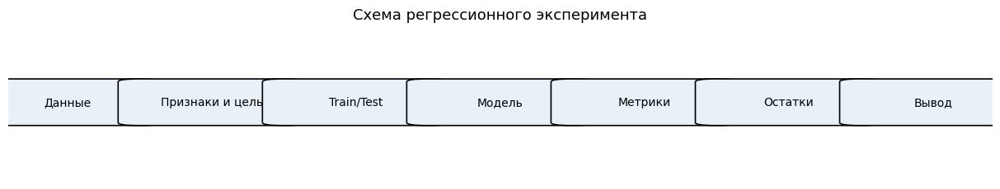

<!--
Диаграмма обобщает все этапы: подготовка признаков; разбиение на
обучающую и тестовую выборки; обучение линейной и полиномиальной
моделей; расчёт метрик; диагностика остатков; формирование
инженерного вывода. Студент сверяет последовательность собственных
действий со схемой.
-->

---

## Структура регрессионного набора данных

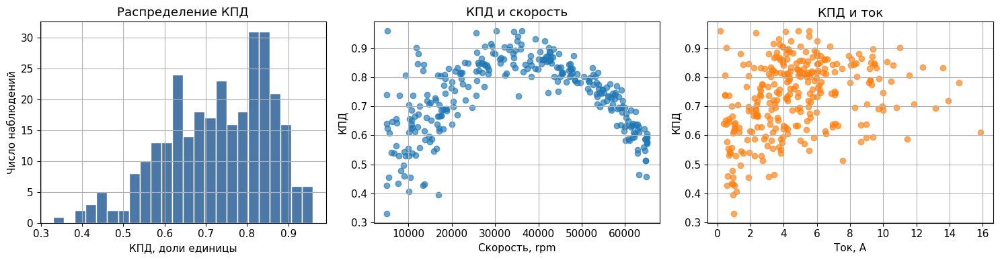

<!--
Гистограммы признаков и целевой переменной. Здесь же демонстрируется
разделение feature-CSV и diagnostics-CSV. В feature-CSV нет current_a
по проектному решению - студент видит это на уровне файловой
структуры.
-->

---

## Диагностика разбиения обучающей и тестовой выборок

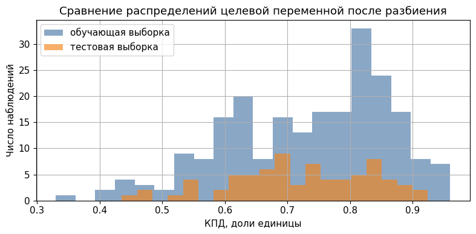

При разбиении должны выполняться условия:

1. фиксированное случайное состояние (англ. random state) для воспроизводимости;
2. соотношение объёмов: обычно $|\mathcal{D}_\text{test}| / |\mathcal{D}| = 0{,}2$ - $0{,}3$;
3. близкие распределения признаков и целевой переменной по двум подвыборкам.

<!--
В шаблоне применяется test_size = 0.25, фиксированный random_state.
Если распределения сильно различаются, обучение происходит на одной
популяции, а проверка на другой; это приводит к завышенной оценке
обобщающей способности.
-->

---

## Корреляционная структура признаков и целевой переменной

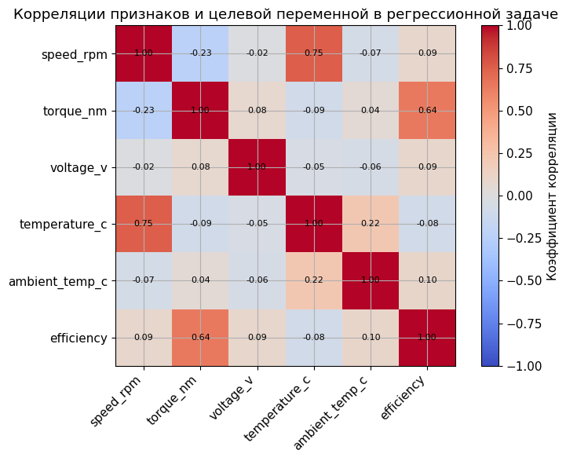

<!--
Тепловая карта (англ. heatmap) коэффициентов корреляции Пирсона.
Для строгого набора признаков видна заметная корреляция temperature_c
и efficiency. Это согласуется с физикой: рост температуры обмотки
повышает сопротивление и тепловые потери, что снижает КПД.
-->

---

<!-- _class: section -->

# Раздел 4
## Практическое задание

---

## Девять шагов работы группы

1. Загрузить файл `practice_02_motor_efficiency_features.csv`.
2. Заполнить список `feature_columns` строгого набора, исключив `current_a`.
3. Разделить выборку на обучающую и тестовую части с фиксированным `random_state`.
4. Обучить линейную регрессию на исходных признаках.
5. Обучить полиномиальную регрессию второй степени с гребневой регуляризацией.
6. Рассчитать MAE, RMSE и $R^2$ на тестовой выборке.
7. Построить графики «истинное значение - прогноз» и «остатки от прогноза».
8. Заполнить сводную таблицу метрик и провести сравнение моделей.
9. Сформулировать инженерный вывод и записать его в аудиторный отчёт.

<!--
Шаг 2 - точка контроля. Преподаватель проходит по группам и проверяет
содержимое feature_columns: отсутствие current_a, output_power_w,
loss_power_w. Это обязательное методическое решение, обоснованное
энергетическим тождеством.
-->

---

## Коэффициенты линейной модели

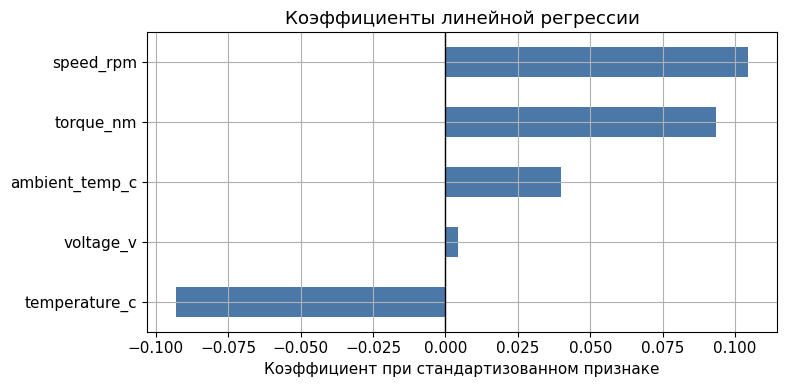

<!--
Знак и абсолютное значение коэффициента позволяют судить о
направлении и интенсивности влияния признака. Отрицательный
коэффициент при temperature_c согласуется с физикой: рост
температуры снижает КПД. Положительный коэффициент при torque_nm
отражает рост КПД в средней области нагрузок.
-->

---

## Графики прогноза и остатков

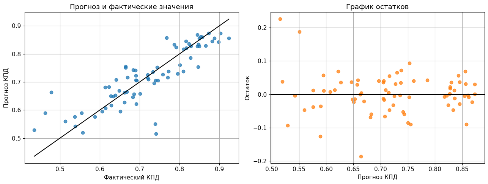

<!--
Слева график «истина - прогноз». Идеальное соответствие
соответствует точкам, лежащим на диагонали y = x.
Справа график остатков. Если облако смещено по вертикали или
имеет систематическую структуру, модель имеет смещение в отдельных
диапазонах.
-->

---

## Парные диагностические зависимости остатков

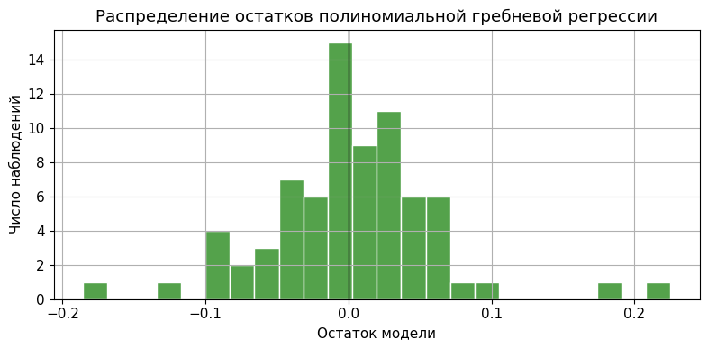

<!--
Дополнительные диагностические графики: распределение остатков
и их зависимость от ключевых признаков. Нормально распределённые
остатки, центрированные около нуля и не имеющие зависимости от
признаков - признак корректно подобранной модели.
-->

---

## Распределение ошибок по диапазонам коэффициента полезного действия

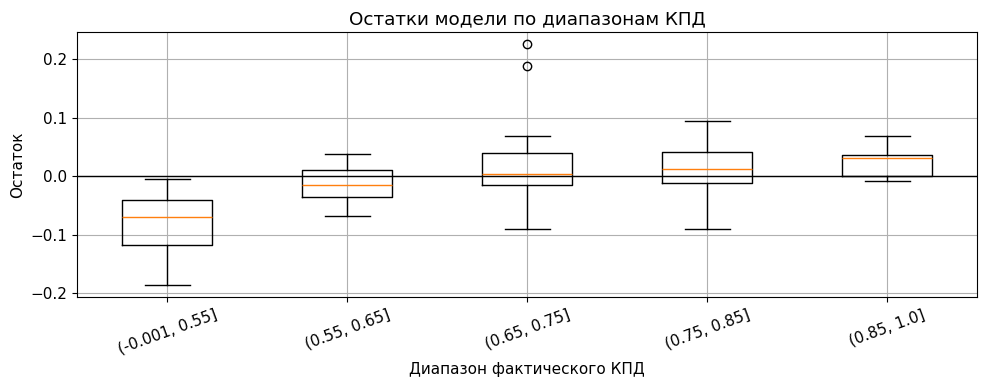

<!--
График показывает, что модель работает менее точно в крайних
диапазонах КПД (низкие и пиковые значения). Это типичная проблема
линейной регрессии в задаче с нелинейной целевой зависимостью.
Полиномиальная модель частично сглаживает этот эффект.
-->

---

## Влияние сложности модели

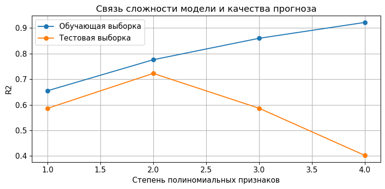

<!--
Зависимость RMSE от степени полинома на обучающей и тестовой
выборках. На обучающей кривая монотонно убывает. На тестовой
имеется минимум при степени 2; дальнейшее увеличение приводит к
переобучению. Это наглядная иллюстрация принципа смещения и
дисперсии (англ. bias-variance trade-off).
-->

---

<!-- _class: warning -->

## Антипример. Модель с включёнными признаками утечки

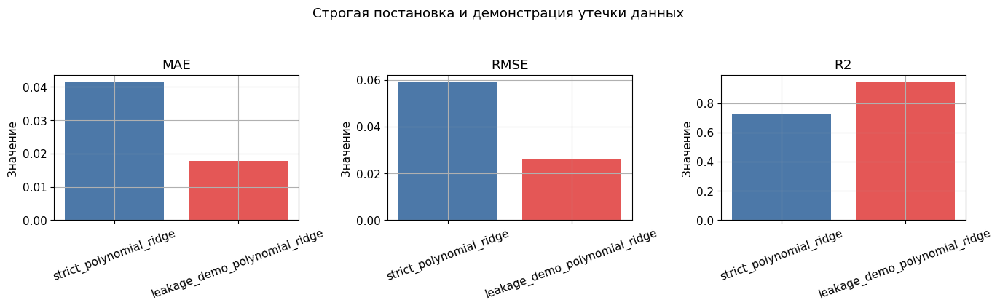

> Использовать в аудиторном отчёте запрещено. Включение
> `current_a`, `output_power_w` и `loss_power_w` даёт $R^2 \approx 0{,}999$.
> Это не показатель качества модели, а следствие арифметической
> восстановимости целевой переменной через энергетическое тождество.

<!--
Самый важный антипример занятия. В реальной инженерной задаче
данных, идеально восстанавливающих целевую переменную, не бывает.
Если они есть, значит, проектная постановка задачи ошибочна.
-->

---

## Сравнение остатков строгой и утечной моделей

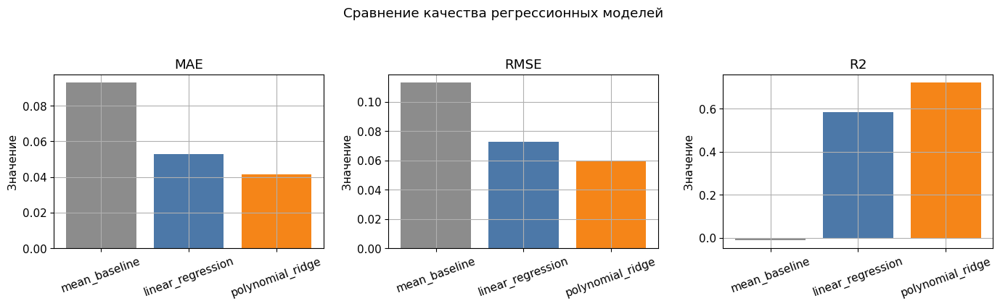

<!--
Слева показаны узкие и симметричные остатки модели с утечкой.
Справа - распределение остатков строгой модели, более широкое,
но соответствующее реальной точности обобщения. Студент должен
выбрать строгую модель для аудиторного отчёта.
-->

---

## Типовые методические ошибки занятия

1. Обучение и проверка модели на одних и тех же данных.
2. Сравнение моделей только по одному графику без расчёта метрик.
3. Игнорирование переобучения полиномиальной модели высокой степени.
4. Включение тока, расчётных мощностей или диагностических столбцов в признаки.
5. Интерпретация ML-модели как полной физической модели электрической машины.

<!--
Пункт 5 особенно важен. Модель регрессии аппроксимирует часть
функциональной зависимости, но не заменяет проектный расчёт
двигателя. Это методическое ограничение должно быть зафиксировано
в инженерном выводе.
-->

---

<!-- _class: checklist -->

## Критерии зачёта

1. Обучены две модели: линейная регрессия и полиномиальная с гребневой регуляризацией.
2. Рассчитаны MAE, RMSE и $R^2$ на тестовой выборке.
3. Построены графики «истина - прогноз» и графики остатков.
4. Заполнена сводная таблица метрик для двух моделей.
5. Признаки с риском утечки явно исключены в составе `feature_columns`.
6. Каждый участник группы написал индивидуальный вывод.

<!--
Включение признаков с утечкой без явного указания на это как на
антипример автоматически переводит работу в категорию «частично
зачтено» независимо от численных значений метрик.
-->

---

## Контрольные вопросы

1. Чем регрессия отличается от классификации?
2. В чём смысл метода наименьших квадратов?
3. Почему RMSE чувствительнее к крупным ошибкам, чем MAE?
4. Почему зависимость КПД от нагрузки может быть нелинейной?
5. Какие признаки могут привести к утечке данных в задаче оценки КПД?

<!--
Дополнительный неформальный вопрос: «что произойдёт, если
вернуть current_a в признаки?» позволяет проверить понимание
энергетического тождества.
-->

---

## Реестр научно-методических источников

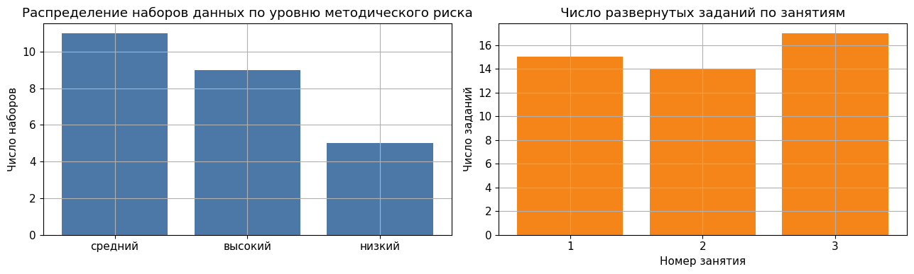

<!--
Те же три внешних источника данных, что и в занятии 1: Zenodo
Electric Motor Temperature, Zenodo PMSM Inverter Fault Diagnosis,
Mendeley EV Powertrain Efficiency. На основе этих наборов
подготовлены расширенные блокноты в notebooks/external. Они
рекомендуются для самостоятельной проектной работы сильных групп.
-->

---

<!-- _class: section -->

# Итог занятия 2

Регрессия в инженерной задаче - это арифметическая аппроксимация,
поддержанная физической интерпретацией.
Высокое значение $R^2$ не всегда означает успех модели: оно может
быть следствием утечки данных.
Метрики качества интерпретируются совместно с графиками остатков.

<!--
Заключительная мысль: модель является инструментом, ответственность
за инженерную интерпретацию остаётся на специалисте. Этот принцип
закрепляется в занятии 3, где интерпретация правил дерева важнее
сравнения метрик.
-->
