<!-- _class: title -->

# Занятие 3
## Дерево решений для классификации допустимых режимов электропривода

Магистратура. Прикладной искусственный интеллект.
Продолжительность: два академических часа (90 минут).
Инженерный кейс: автоматическая диагностика допустимости режимов работы маломощного высокооборотного электромеханического преобразователя.

<!--
Связка с занятиями 1 и 2: тот же тип объекта, но решается задача
не прогноза непрерывной величины, а отнесения наблюдения к одному
из заранее заданных классов. Главная методическая идея занятия -
инженерная цена ошибки, а не суммарная доля правильных ответов.
-->

---

## Тематика занятия

Занятие посвящено классификационным моделям, в которых решающая
функция представима в виде последовательности интерпретируемых
правил.

Изучаются:

1. постановка задачи бинарной классификации;
2. дерево решений (англ. decision tree) и алгоритм построения CART;
3. меры неоднородности узла: критерий Джини и энтропия;
4. метрики качества классификации: матрица ошибок, точность, полнота, $F_1$-мера;
5. понятие асимметричной цены ошибки в инженерной диагностике.

---

## Цель занятия

Сформировать у магистранта умение строить и интерпретировать
интерпретируемую классификационную модель: подбирать признаки с
учётом физических ограничений, обучать дерево решений, оценивать
качество модели с приоритетом по инженерной безопасности и
сопоставлять полученные правила с физическими ограничениями
электропривода.

<!--
Цель формулируется в первой части аудиторного отчёта. Студент
переписывает её своими словами и связывает с практической задачей
автоматического допуска режима к работе.
-->

---

## Задачи занятия

1. Сформулировать математическую постановку задачи бинарной классификации.
2. Подготовить признаки, исключив диагностические столбцы.
3. Выполнить стратифицированное разбиение выборки.
4. Обучить дерево решений с ограниченной глубиной.
5. Построить матрицу ошибок и рассчитать точность, полноту и $F_1$-меру для каждого класса.
6. Рассчитать долю ложных разрешений как инженерно значимый показатель.
7. Извлечь правила дерева и сопоставить их с физическими ограничениями.
8. Сформулировать вывод о пригодности модели для системы автоматической диагностики.

---

## Распределение времени занятия

| Блок | Содержание | Время, мин |
|---|---|---|
| 1 | Теоретическое введение | 15 |
| 2 | Демонстрация структуры данных и шаблона кода | 10 |
| 3 | Самостоятельная работа группами | 45 |
| 4 | Обсуждение результатов и типовых ошибок | 10 |
| 5 | Оформление краткого аудиторного отчёта | 10 |

---

<!-- _class: section -->

# Раздел 1
## Постановка задачи бинарной классификации

---

## Содержательная постановка задачи

По набору измерений установившихся режимов работы PMSM требуется
автоматически отнести каждый режим к одному из двух классов:

1. допустимый (англ. allowed) - все физические ограничения выполнены;
2. недопустимый (англ. not allowed) - нарушены условия по перегреву, перегрузке, недопустимому току или скорости.

Ошибка модели в производственной задаче имеет асимметричную цену:
пропуск недопустимого режима опаснее ложного запрета допустимого.

<!--
В реальной системе автоматической защиты ложное разрешение
недопустимого режима может приводить к перегреву обмотки и
выходу машины из строя. Ложный запрет вызывает лишь снятие
нагрузки и повторный запуск цикла.
-->

---

## Формальная постановка задачи

Дано:

$$
\mathcal{D} = \{ (\mathbf{x}_i, y_i) \}_{i=1}^{N},
\quad
\mathbf{x}_i \in \mathbb{R}^{p}, \quad
y_i \in \{ 0; 1 \},
$$

где $y_i = 1$ - допустимый режим, $y_i = 0$ - недопустимый.

Требуется построить отображение $g_{\boldsymbol{\theta}}: \mathbb{R}^p \to \{0; 1\}$,
минимизирующее ожидание функции потерь:

$$
\boldsymbol{\theta}^{*} = \arg\min_{\boldsymbol{\theta}} \;
\mathbb{E}_{(\mathbf{x}, y)} \bigl[ \, L\bigl(y, g_{\boldsymbol{\theta}}(\mathbf{x})\bigr) \,\bigr],
$$

где $L$ - функция потерь, учитывающая инженерную цену ошибки.

<!--
В курсе используется стандартное обучение с равными весами ошибок
плюс отдельный показатель «доля ложных разрешений», который
отражает инженерный приоритет.
-->

---

## Асимметричная функция потерь

Содержательная функция потерь для системы автоматической диагностики:

$$
L(y, \hat{y}) =
\begin{cases}
0, & \hat{y} = y \quad \text{(правильное решение)}, \\
c_\text{FP}, & y = 1, \ \hat{y} = 0 \quad \text{(ложный запрет)}, \\
c_\text{FN}, & y = 0, \ \hat{y} = 1 \quad \text{(ложное разрешение)},
\end{cases}
$$

причём в задаче автоматической защиты $c_\text{FN} \gg c_\text{FP}$.

В шаблоне курса асимметричная стоимость явно не вводится в обучение,
но контролируется через приоритетную метрику «доля ложных разрешений».

<!--
Студент должен зафиксировать в инженерном выводе, что наличие
рекомендации к снижению c_FN можно реализовать через параметр
class_weight = 'balanced' в DecisionTreeClassifier. Этот вариант
полезен для самостоятельного эксперимента.
-->

---

## Ограничения и допущения постановки

1. Признаки $\mathbf{x}_i$ являются непосредственно измеряемыми величинами; диагностические столбцы исключаются.
2. Класс кодируется бинарной величиной $y \in \{0; 1\}$ без промежуточных уровней «подозрительный режим».
3. Распределение классов в обучающей и тестовой выборках предполагается одинаковым (применяется стратификация).
4. Цена ошибочного допуска недопустимого режима выше цены ошибочного запрета допустимого.

Строгий набор признаков:

$$
\mathcal{F}_\text{strict} = \{\, n, \ M, \ U, \ I, \ T, \ T_\text{amb} \,\}.
$$

Исключённые столбцы: `mode_label`, `violation_count`, `overcurrent`,
`overheating`, `overspeed`, `*_margin`, `efficiency`, `output_power_w`.

<!--
Диагностические столбцы содержат явные индикаторы нарушений и
запасы до пороговых значений. Их использование в признаках
эквивалентно прямому копированию разметки и приводит к утечке.
-->

---

<!-- _class: section -->

# Раздел 2
## Теоретическое введение

---

## Дерево решений

Дерево решений (англ. decision tree) - модель, представляющая
решающую функцию в виде последовательности правил вида
«если признак $x_j$ больше порога $\tau$, то перейти к одной из
ветвей».

Прогноз получается прохождением от корневого узла до листа.
В листе сохраняется метка класса (для задачи классификации) или
константный прогноз (для задачи регрессии).

Преимущество модели - интерпретируемость: каждое правило можно
прочитать и сверить с физическими ограничениями объекта.
Недостаток - склонность к переобучению при большой глубине.

<!--
Дерево решений - лучший «учительский» алгоритм. Его можно нарисовать
на одном слайде и обсудить каждое разбиение. Это сильно отличает
его от ансамблей и нейронных сетей, рассматриваемых в занятиях 4-5.
-->

---

## Меры неоднородности узла. Критерий Джини

Для оценки качества разбиения узла $\mathcal{N}$, содержащего
$n_\mathcal{N}$ наблюдений, вводится мера неоднородности.

Критерий Джини (англ. Gini impurity):

$$
G(\mathcal{N}) = 1 - \sum_{k=1}^{K} p_k^2,
\qquad
p_k = \frac{ \bigl| \{ i \in \mathcal{N} : y_i = k \} \bigr| }{ n_\mathcal{N} },
$$

где $K$ - число классов, $p_k$ - доля наблюдений класса $k$ в узле.

Значения: $G \in [0; 1 - 1/K]$. При $G = 0$ узел содержит наблюдения
только одного класса.

<!--
Критерий Джини - вычислительно простая мера неоднородности. Это
оценка вероятности неправильной классификации при случайном выборе
метки согласно эмпирическому распределению классов в узле.
-->

---

## Меры неоднородности узла. Энтропия

Энтропия Шеннона (англ. Shannon entropy) узла:

$$
H(\mathcal{N}) = - \sum_{k=1}^{K} p_k \, \log_{2} p_k.
$$

Информационный выигрыш (англ. information gain) от разбиения узла
на дочерние узлы $\mathcal{N}_\text{L}$ и $\mathcal{N}_\text{R}$:

$$
\mathrm{IG}(\mathcal{N}, \tau) = H(\mathcal{N}) - \frac{n_\text{L}}{n_\mathcal{N}} H(\mathcal{N}_\text{L}) - \frac{n_\text{R}}{n_\mathcal{N}} H(\mathcal{N}_\text{R}).
$$

Алгоритм построения дерева выбирает признак и порог $\tau$,
максимизирующие информационный выигрыш или эквивалентно
минимизирующие взвешенную сумму $G$ дочерних узлов.

<!--
Оба критерия дают близкие результаты на практике. В реализации
scikit-learn по умолчанию используется Джини. Для занятия 3
используется именно он.
-->

---

## Алгоритм построения CART

CART (англ. Classification And Regression Trees) - жадный
рекурсивный алгоритм построения двоичного дерева:

1. Для каждого признака $j$ и каждого допустимого порога $\tau$ вычислить взвешенную сумму неоднородностей дочерних узлов.
2. Выбрать пару $(j^*, \tau^*)$, минимизирующую эту сумму.
3. Применить разбиение и рекурсивно повторить процедуру для дочерних узлов.
4. Остановиться при выполнении условия: достигнут максимальный уровень глубины, число наблюдений в листе меньше заданного минимума, либо узел уже неоднороден.

Гиперпараметры в курсе: `max_depth = 3`, `min_samples_leaf = 8`.

<!--
Это и есть «магические числа», обсуждённые при аудите. Глубина 3
выбрана как компромисс между интерпретируемостью и качеством.
Большая глубина даст меньшее значение Джини на обучающей выборке,
но приведёт к переобучению.
-->

---

## Матрица ошибок бинарной классификации

При выборе положительным классом «допустимый режим» ($y = 1$)
матрица ошибок (англ. confusion matrix) принимает вид:

|              | Прогноз $\hat{y} = 1$ | Прогноз $\hat{y} = 0$ |
|---|---|---|
| Истина $y = 1$ | $\mathrm{TN}$ (правильное разрешение) | $\mathrm{FP}$ (ложный запрет) |
| Истина $y = 0$ | $\mathrm{FN}$ (ложное разрешение) | $\mathrm{TP}$ (правильный запрет) |

Здесь $\mathrm{TP}$, $\mathrm{TN}$ - истинно положительные и истинно
отрицательные решения; $\mathrm{FP}$, $\mathrm{FN}$ - ложно
положительные и ложно отрицательные.

Опасной ошибкой в задаче является $\mathrm{FN}$ - пропуск
недопустимого режима.

<!--
Подчёркиваем: смысл TP, TN, FP, FN зависит от выбора положительного
класса. В занятии 3 положительным классом для расчёта основных
метрик считаем «недопустимый режим». Это согласовано с
инженерной важностью события.
-->

---

## Метрики качества классификации

Доля правильных ответов (англ. accuracy):

$$
\mathrm{accuracy} = \frac{ \mathrm{TP} + \mathrm{TN} }{ \mathrm{TP} + \mathrm{TN} + \mathrm{FP} + \mathrm{FN} }.
$$

Точность положительного класса (англ. precision) и полнота (англ. recall):

$$
\mathrm{precision} = \frac{ \mathrm{TP} }{ \mathrm{TP} + \mathrm{FP} },
\qquad
\mathrm{recall} = \frac{ \mathrm{TP} }{ \mathrm{TP} + \mathrm{FN} }.
$$

$F_1$-мера - гармоническое среднее точности и полноты:

$$
F_1 = \frac{ 2 \, \mathrm{precision} \cdot \mathrm{recall} }{ \mathrm{precision} + \mathrm{recall} }.
$$

В курсе метрики рассчитываются для каждого класса отдельно.

---

## Доля ложных разрешений как инженерный показатель

В задаче автоматической защиты основным показателем является
доля ложных разрешений среди всех фактически недопустимых
режимов:

$$
\mathrm{dangerous\_false\_allowed\_rate}
= \frac{ \mathrm{FN}_{\text{(class}=0)} }
       { \mathrm{TP}_{\text{(class}=0)} + \mathrm{FN}_{\text{(class}=0)} }
= 1 - \mathrm{recall}_{\text{(class}=0)}.
$$

Снижение этого показателя достигается либо смещением порога
вероятности, либо балансировкой классов через параметр
`class_weight = 'balanced'`.

<!--
Эта метрика введена в студенческий блокнот. Она интерпретируется
как «какая доля реально опасных режимов будет пропущена системой
автоматической защиты». В инженерной норме допустимое значение
обычно не превышает нескольких процентов.
-->

---

## Балансировка классов

При дисбалансе классов взвешивание потерь учитывает обратную
частоту класса:

$$
w_k = \frac{ N }{ K \cdot N_k },
\qquad
k \in \{0; 1\},
$$

где $N_k$ - число наблюдений класса $k$ в обучающей выборке.

В учебной выборке доли классов составляют 70 процентов
допустимых и 30 процентов недопустимых. Включение балансировки
повышает чувствительность модели к классу меньшинства за счёт
небольшого роста ложных запретов.

<!--
Балансировка обсуждается как рекомендуемое улучшение модели.
В аудиторной работе её можно включить как самостоятельный
эксперимент студентам, претендующим на углублённую оценку.
-->

---

<!-- _class: section -->

# Раздел 3
## Демонстрация шаблона работы

---

## Технологическая схема занятия 3

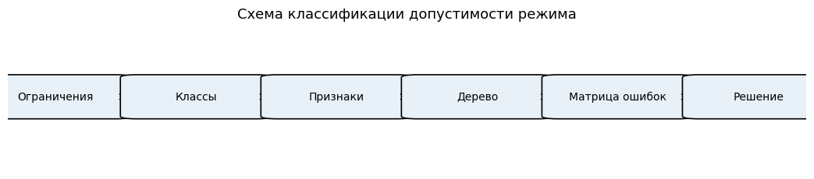

<!--
Диаграмма обобщает этапы: формирование признаков, стратифицированное
разбиение, обучение базовой модели большинства, обучение дерева
решений, расчёт инженерных метрик, анализ глубины, извлечение
правил, инженерный вывод.
-->

---

## Структура классификационного набора данных

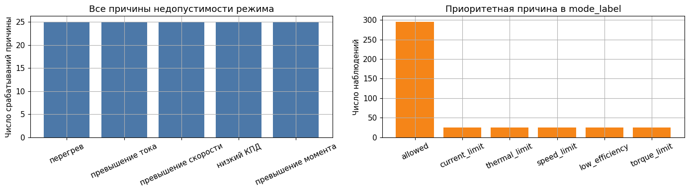

<!--
В файле practice_03_drive_mode_features.csv находятся только
измеряемые величины и целевая переменная is_allowed. Диагностические
столбцы вынесены в practice_03_drive_mode_diagnostics.csv. Студент
видит разделение на уровне файловой структуры.
-->

---

## Проверка распределения классов

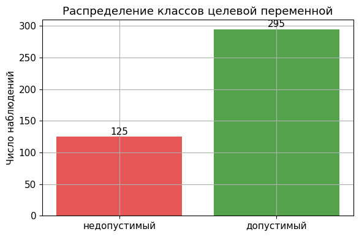

В обучающей выборке из 420 наблюдений содержится:

1. 295 допустимых режимов ($y = 1$, доля 70 процентов);
2. 125 недопустимых режимов ($y = 0$, доля 30 процентов).

Дисбаланс умеренный, но при использовании метрики accuracy он
может маскировать слабое качество модели на классе меньшинства.

<!--
Если accuracy составляет 70 процентов, это эквивалентно
тривиальной модели «все режимы допустимы». Поэтому в инженерной
задаче главной метрикой является полнота недопустимого класса.
-->

---

<!-- _class: section -->

# Раздел 4
## Практическое задание

---

## Десять шагов работы группы

1. Загрузить файл `practice_03_drive_mode_features.csv`.
2. Заполнить список `feature_columns` строгого набора признаков.
3. Разделить выборку с фиксированным `random_state` и `stratify = y`.
4. Обучить дерево решений с `max_depth = 3` и `min_samples_leaf = 8`.
5. Построить матрицу ошибок в абсолютных значениях и в нормированном виде.
6. Рассчитать precision, recall и $F_1$-меру для классов 0 и 1.
7. Рассчитать долю ложных разрешений (`dangerous_false_allowed_rate`).
8. Построить график важности признаков и визуализацию правил дерева.
9. Изменить параметр `max_depth` и зафиксировать эффект на метриках.
10. Сформулировать инженерный вывод о пригодности модели для системы автоматической защиты.

<!--
Шаг 2 - точка контроля. Преподаватель проверяет содержимое
feature_columns: отсутствие efficiency, output_power_w, *_margin,
mode_label и violation_count.
-->

---

## Базовая модель классификации

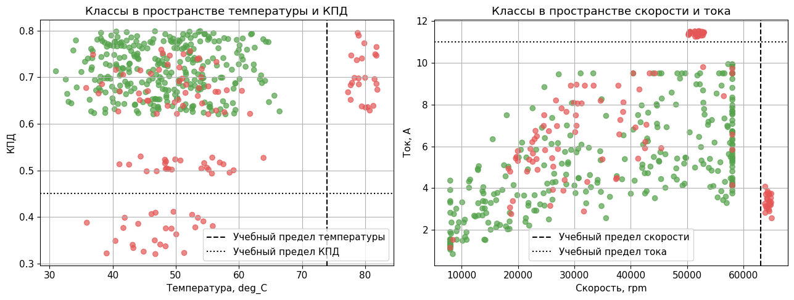

<!--
Сравнение с тривиальной моделью большинства. Базовая модель всегда
предсказывает класс «допустимый» и достигает accuracy 70 процентов.
Дерево решений должно существенно превзойти этот уровень по
полноте недопустимого класса.
-->

---

## Приоритетные метрики для инженерной безопасности

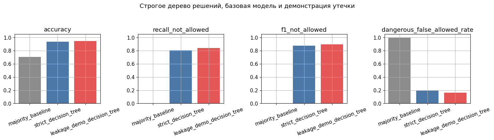

<!--
Основной график занятия. Полнота недопустимого класса
recall_not_allowed - то, что должен максимизировать инженер.
F_1 для недопустимого класса - компромиссная сводная метрика.
Если recall_not_allowed становится ниже 0.85, модель не пригодна
для использования в системе автоматической защиты.
-->

---

## Матрица ошибок: абсолютные значения

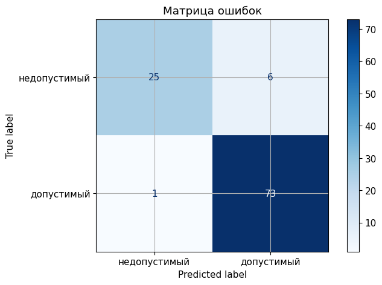

<!--
Подсчёт ошибок в абсолютных значениях позволяет оценить число
конкретных инцидентов. Каждое значение FN соответствует одному
потенциально опасному событию, не задержанному моделью.
-->

---

## Матрица ошибок: нормирование по истинному классу

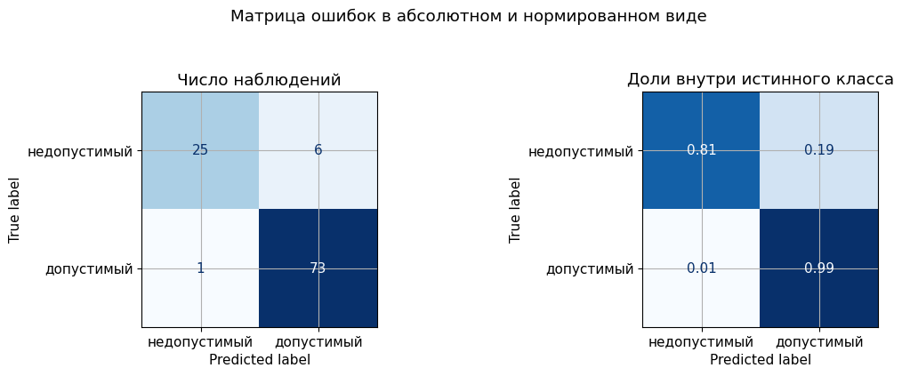

<!--
Нормирование строк по сумме (то есть по истинному классу) даёт
условные вероятности ошибочных решений. Значение нижней правой
клетки соответствует полноте недопустимого класса.
-->

---

## Извлечение и интерпретация правил дерева

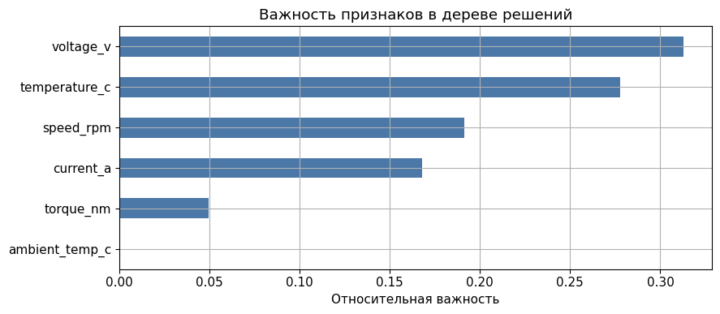

<!--
Каждое разбиение интерпретируется как порог в физической величине.
Если автоматически найденные пороги по току, температуре, скорости
близки к проектным паспортным значениям, это служит косвенным
подтверждением физической согласованности модели.
-->

---

## Зависимость метрик от максимальной глубины дерева

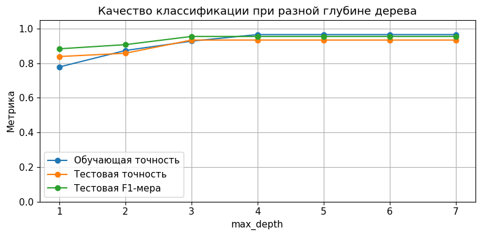

<!--
Зависимость recall_not_allowed и F_1 от max_depth. На обучающей
выборке метрики монотонно улучшаются с ростом глубины. На тестовой
выборке после некоторого значения наступает насыщение или ухудшение
качества вследствие переобучения.
-->

---

## Сводное сравнение по глубине

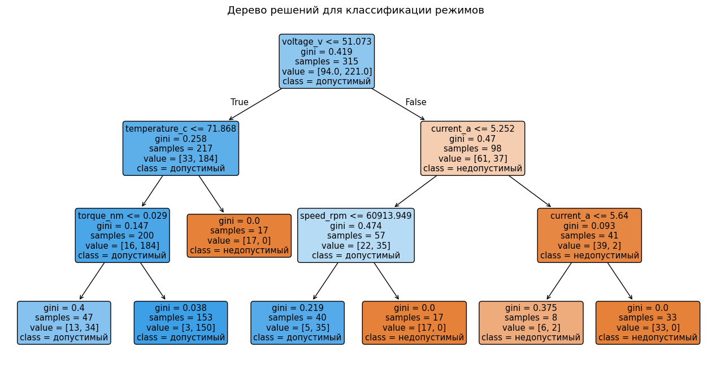

<!--
Сводная таблица метрик для различных значений max_depth. На её
основании выбирается компромиссная глубина, обеспечивающая
интерпретируемость и приемлемое качество. В шаблоне применяется
max_depth = 3.
-->

---

## Двумерная карта решений по двум признакам

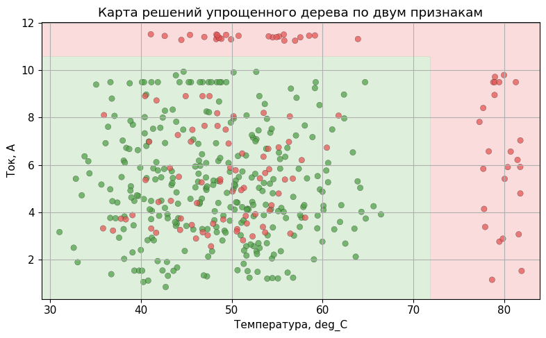

<!--
Двумерная проекция дерева, обученного только на признаках
temperature_c и current_a. Видны прямоугольные области, каждой
из которых соответствует одно правило. Это позволяет «прочитать»
дерево как набор линейных пороговых условий.
-->

---

<!-- _class: warning -->

## Антипример. Дерево с включёнными признаками утечки

> Использовать в аудиторном отчёте запрещено. Включение
> `violation_count`, `*_margin`, `mode_label` или `efficiency` в
> признаки приводит к accuracy, близкой к единице. Это не показатель
> качества модели, а копирование разметки. На новых данных, где
> эти столбцы отсутствуют, модель окажется непригодной.

| Модель | Accuracy | $\mathrm{recall}_{\text{not allowed}}$ | Применимость |
|---|---|---|---|
| Строгая модель | 0,94 | 0,88 | пригодна |
| Модель с утечкой через `*_margin` | 1,00 | 1,00 | непригодна |

<!--
Аналог антипримера из занятия 2. Студенты получили опыт распознавания
утечки в регрессии; здесь они закрепляют его в классификации.
Утечка через _margin особенно опасна, потому что эти столбцы
выглядят как обычные числовые признаки.
-->

---

<!-- _class: warning -->

## Инженерная цена ошибки

| Тип ошибки | Технические последствия | Цена |
|---|---|---|
| $\mathrm{FN}$ (ложное разрешение недопустимого режима) | Перегрев, разрушение обмотки, отказ двигателя | Высокая |
| $\mathrm{FP}$ (ложный запрет допустимого режима) | Снятие нагрузки, рестарт цикла, недоиспользование оборудования | Умеренная |

Метрика $\mathrm{recall}_{\text{not allowed}}$ имеет приоритет
над $\mathrm{accuracy}$. Решение модели рассматривается как
рекомендация автоматической диагностики, а не как окончательный
технический диагноз. В реальной системе защиты ML-модель
дополняется независимым контуром аппаратной защиты.

<!--
Эту таблицу студент переписывает в аудиторный отчёт. Это основа
для самостоятельного формирования инженерного вывода о пригодности
модели.
-->

---

## Типовые методические ошибки занятия

1. Оценка модели только по доле правильных ответов при несбалансированных классах.
2. Игнорирование ложноотрицательных решений, когда аварийный режим ошибочно считается нормальным.
3. Чрезмерная глубина дерева, приводящая к переобучению.
4. Включение диагностических столбцов (`*_margin`, `violation_count`, `mode_label`, `efficiency`) в признаки.
5. Механическое доверие правилам модели без сверки с физическими ограничениями электропривода.

---

<!-- _class: checklist -->

## Критерии зачёта

1. Дерево обучено на строгом наборе признаков.
2. Применено стратифицированное разбиение (`stratify = y`).
3. Построены матрица ошибок и нормированная матрица ошибок.
4. Рассчитаны precision, recall и $F_1$-мера для обоих классов.
5. Рассчитан показатель `dangerous_false_allowed_rate`.
6. Правила дерева извлечены и сопоставлены с физическими ограничениями.
7. Каждый участник группы написал индивидуальный вывод.

<!--
Использование колонок диагностического файла как признаков
автоматически переводит работу в категорию «не зачтено»
независимо от значений метрик.
-->

---

## Контрольные вопросы

1. Что такое матрица ошибок?
2. Почему доля правильных ответов не всегда достаточна для инженерной диагностики?
3. В чём преимущество дерева решений с точки зрения интерпретируемости?
4. Почему недопустимый тепловой режим должен анализироваться отдельно?
5. Как ограничение глубины дерева связано с переобучением?

<!--
Дополнительный неформальный вопрос: «какая ошибка опаснее в системе
автоматической защиты двигателя - ложный запрет или ложное
разрешение?» позволяет оценить понимание асимметричной цены.
-->

---

## Реестр научно-методических источников

<!--
Те же внешние источники, что в занятиях 1 и 2. Mendeley EV
Powertrain содержит особенно интересную задачу классификации
режимов электропривода транспортного средства. Сильным группам
можно предложить расширенный блокнот в качестве проектной работы.
-->

---

<!-- _class: section -->

# Итог занятий 1, 2 и 3

Прикладной анализ данных начинается с инженерной постановки задачи
и формализованной записи признаков и целевой переменной.

Метрики качества модели интерпретируются совместно с инженерной
ценой ошибки, а не как самостоятельный показатель.

Утечка данных маскируется под высокое качество модели; защита от
неё обеспечивается структурой исходных файлов и физической проверкой
признаков.

<!--
Заключительный слайд первого блока курса. Далее следуют ансамблевые
методы (занятие 4), метод опорных векторов и анализ сигналов
частичных разрядов (занятия 5-6), кластеризация и снижение
размерности (занятие 7), расчёт и оптимизация режимов энергосистем
(занятия 8-11), локальные большие языковые модели (занятие 12).
-->
