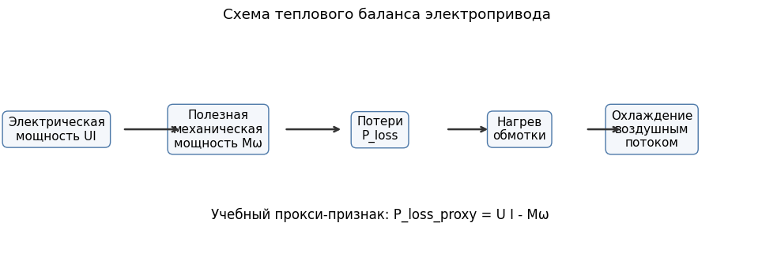
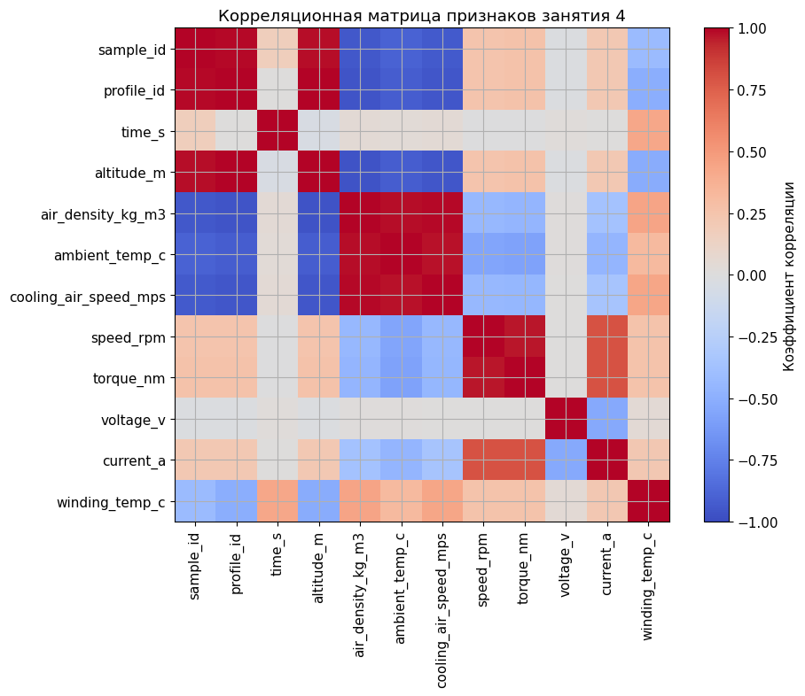
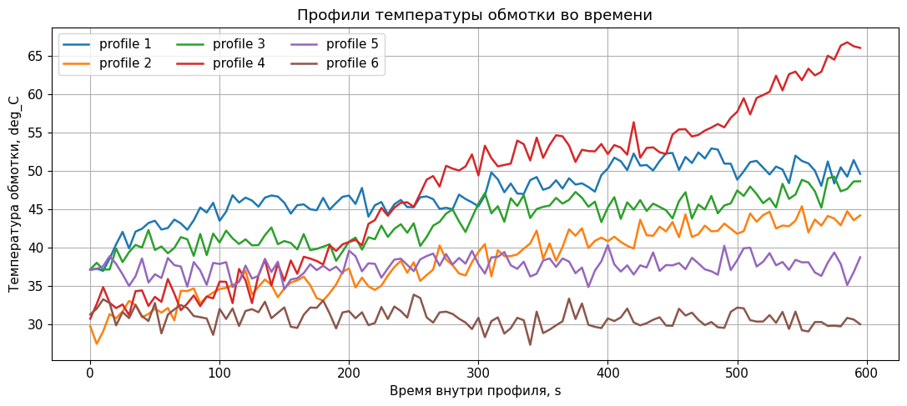
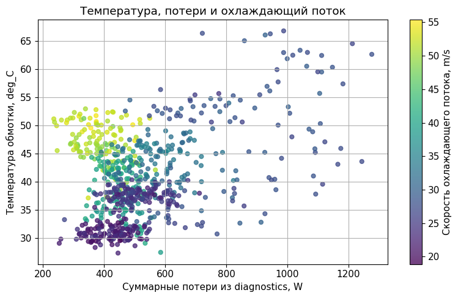
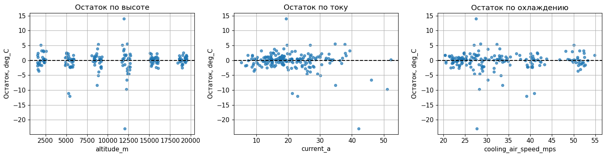
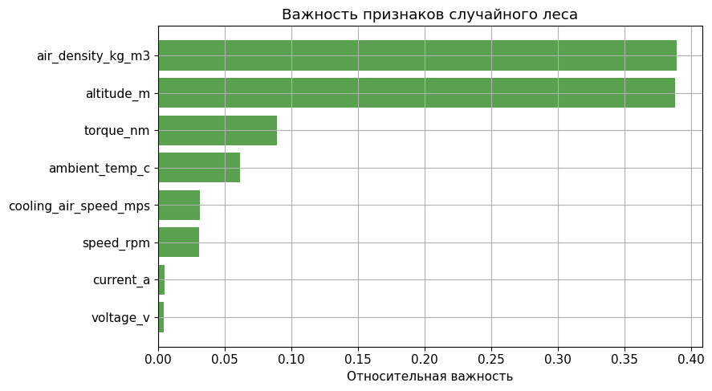
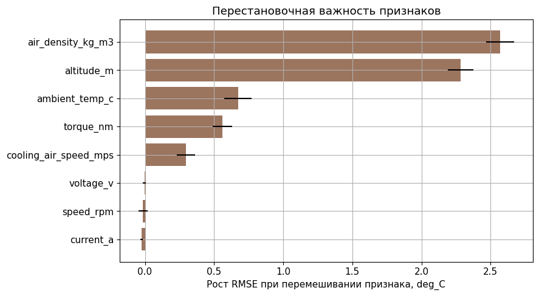
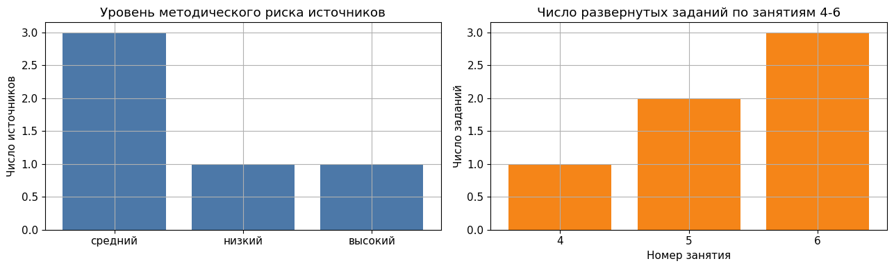

<!-- _class: title -->

# Занятие 4
## Прогноз температуры электропривода HAPS

Регрессия теплового режима, физически мотивированная модель,
случайный лес и градиентный бустинг.

<!--
Открывая занятие, преподаватель связывает практику 4 с занятиями 1-3:
студенты уже умеют различать признаки и целевую переменную, строить
регрессию и распознавать утечку данных. Теперь эти действия применяются к
тепловому режиму объекта с временной и профильной структурой.
-->

---

## Цель занятия

Сформировать начальный навык построения моделей регрессии для прогноза
температуры обмотки электропривода высотной псевдоспутниковой платформы.

HAPS (High Altitude Platform Station) - высотная псевдоспутниковая
платформа длительного пребывания в стратосфере.

<!--
Важно не уходить в подробную аэродинамику HAPS. Для данного занятия HAPS
является инженерным контекстом, который объясняет, почему температура,
масса, охлаждение и энергетический баланс важны для модели.
-->

---

## Распределение времени занятия

| Блок | Содержание | Время, мин |
|---|---|---:|
| 1 | Тепловая постановка и структура данных | 15 |
| 2 | Разведочный анализ и риск утечки | 15 |
| 3 | Обучение моделей и самостоятельные TODO | 35 |
| 4 | Остатки, важность признаков, антипример | 15 |
| 5 | Вывод и мини-задание по открытому источнику | 10 |

<!--
Тайминг следует удерживать явно. Если студенты задерживаются на подборе
параметров случайного леса, преподаватель ограничивает эксперимент
диапазоном max_depth от 3 до 10 и возвращает группу к интерпретации.
-->

---

<!-- _class: section -->

# Раздел 1
## Тепловая постановка задачи

---

## Содержательная постановка задачи

Имеется набор режимов электропривода высотной платформы. Для каждого
режима известны внешние условия, электрические величины и нагрузка.

Требуется:

1. спрогнозировать температуру обмотки;
2. сравнить физически мотивированную модель с моделями машинного
   обучения;
3. определить, какие признаки наиболее связаны с тепловым режимом;
4. не допустить утечки через расчетные диагностические столбцы.

<!--
Этот слайд переводит математическую задачу в инженерный язык. Студент
должен понимать, что прогноз температуры нужен для оценки допустимости
режима, а не ради абстрактного улучшения метрики.
-->

---

## Формальная постановка задачи

Дано:

$$
\mathcal{D} = \{(\mathbf{x}_i, y_i)\}_{i=1}^{N},
\qquad y_i = T_{\text{winding}, i},
$$

где $\mathbf{x}_i$ - вектор измеряемых признаков режима,
$y_i$ - температура обмотки.

Требуется построить модель:

$$
\hat{y}_i = f(\mathbf{x}_i)
$$

и минимизировать ошибку прогноза по MAE и RMSE без использования
диагностических столбцов.

<!--
Формальная запись нужна для единого научного стиля курса. Отдельно
проговорить, что diagnostics-CSV не входит в множество допустимых
признаков.
-->

---

## Практическое задание

1. Загрузить feature-CSV и diagnostics-CSV.
2. Выбрать безопасные признаки.
3. Рассчитать прокси-потери `P_loss_proxy`.
4. Сравнить случайное и групповое разбиение.
5. Обучить физическую модель, Ridge, Random Forest и Gradient Boosting.
6. Рассчитать MAE, RMSE и R2.
7. Проанализировать остатки и важность признаков.
8. Объяснить антипример утечки через `steady_state_temp_c`.

<!--
Список шагов должен быть видим студенту до начала работы. Это снижает
когнитивную нагрузку: студент понимает, какие действия должны появиться
в отчете.
-->

---

## Инженерная постановка

Целевая переменная:

$$
y = T_{winding},
$$

где $T_{winding}$ - температура обмотки двигателя.

Признаки:

1. высота и плотность воздуха;
2. температура окружающей среды;
3. скорость охлаждающего потока;
4. скорость, момент, напряжение и ток.

<!--
На этом слайде нужно добиться, чтобы студент произнес: цель - температура
обмотки, признаки - измеряемые режимные и внешние величины. Diagnostics
не является источником признаков базовой модели.
-->

---

## Тепловая модель первого порядка

$$
T_{k+1} = T_k + \frac{\Delta t}{\tau}
\left(T_{amb,k} + R_{th} P_{loss,k} - T_k\right)
$$

Здесь $R_{th}$ - тепловое сопротивление, $\tau$ - тепловая постоянная
времени, $P_{loss}$ - суммарные потери.

Учебная физическая аппроксимация:

$$
P_{loss,proxy} = U I - M \omega.
$$

<!--
Пояснить, что формула прокси-потерь не заменяет тепловой расчет, но
создает физически понятную базовую линию. Это снижает риск восприятия
машинной модели как "черного ящика", не связанного с физикой.
-->

---

## Последовательность анализа

Студент должен различать измеряемые признаки, расчетные диагностические
величины и целевую переменную.

<!--
Схема нужна для фиксации порядка действий. Особенно важно указать:
diagnostics подключается только для интерпретации и антипримера, а не на
этапе обучения базовой модели.
-->

---

<!-- _class: section -->

# Раздел 2
## Модели и данные

---

## Модели

1. Физически мотивированная линейная модель.
2. Ridge-регрессия - линейная модель с L2-регуляризацией.
3. Random Forest, случайный лес - ансамбль деревьев решений.
4. Gradient Boosting, градиентный бустинг - последовательное уточнение
   ошибки предыдущих деревьев.

<!--
Сравнение моделей строится по принципу "от простого к сложному": сначала
физически мотивированная модель, затем линейная регуляризованная модель,
после этого ансамбли деревьев.
-->

---

## Ridge-регрессия

Ridge-регрессия - линейная регрессия с L2-регуляризацией:

$$
\min_{\mathbf{w}} \sum_{i=1}^{N}(y_i - \mathbf{w}^{T}\mathbf{x}_i)^2
 + \alpha \sum_{j=1}^{p}w_j^2.
$$

Параметр $\alpha$ штрафует слишком большие коэффициенты и повышает
устойчивость модели при связанных признаках.

<!--
Здесь важно объяснить, что Ridge остается линейной моделью. Она полезна
как интерпретируемая базовая линия, но не обязана описывать нелинейную
тепловую динамику лучше ансамблей.
-->

---

## Случайный лес

Random Forest, случайный лес, строит несколько деревьев решений на
разных подвыборках данных и усредняет их прогнозы:

$$
\hat{y} = \frac{1}{B}\sum_{b=1}^{B} f_b(\mathbf{x}).
$$

Ограничение `max_depth` уменьшает риск переобучения и делает модель
более устойчивой.

<!--
Связать параметр max_depth с TODO в блокноте. Студенту не нужно
подбирать десятки параметров; достаточно увидеть, как ограничение глубины
влияет на качество и интерпретацию.
-->

---

## Градиентный бустинг

Gradient Boosting, градиентный бустинг, строит деревья последовательно:
каждая следующая модель приближает ошибку предыдущих.

Упрощенно:

$$
\hat{y}^{(m)} = \hat{y}^{(m-1)} + \nu h_m(\mathbf{x}),
$$

где $h_m$ - очередное дерево, $\nu$ - скорость обучения.

<!--
Пояснить, что бустинг может быть точным, но требует контроля сложности.
В учебном блокноте он нужен для сравнения с случайным лесом и Ridge.
-->

---

## Структура данных

Feature-CSV:

`practice_04_haps_thermal_features.csv`

Diagnostics-CSV:

`practice_04_haps_thermal_diagnostics.csv`

Диагностические столбцы не включаются в базовую модель.

<!--
Проверить, что студенты понимают различие feature-CSV и diagnostics-CSV.
Можно задать вопрос: "Почему steady_state_temp_c нельзя добавить в
признаки, если он хорошо связан с температурой?"
-->

---

<!-- _class: section -->

# Раздел 3
## Анализ и интерпретация

---

## Разведочный анализ

<!--
Попросить студентов назвать один физически ожидаемый тренд и один
потенциально подозрительный признак. Это переводит график из иллюстрации
в инструмент анализа.
-->

---

## Температурные профили

Тепловая инерция делает случайное перемешивание близких точек
методически рискованным.

<!--
Ключевой вывод: близкие точки одного профиля не являются независимыми
наблюдениями в строгом смысле. Поэтому сравнение случайного и группового
разбиения является частью методической проверки.
-->

---

## Потери и температура

Diagnostics-CSV используется для объяснения, но не для обучения строгой
модели.

<!--
График полезен именно как объяснение физического механизма. Нельзя
разрешать студентам переносить total_loss_w в признаки без явной пометки
антипримера.
-->

---

## Корреляционная структура

Корреляции помогают выявить связанные признаки, но не доказывают
причинную связь.

<!--
Высокая корреляция между признаками может влиять на устойчивость
интерпретации важности. Для инженерного вывода требуется сопоставление с
физической постановкой.
-->

---

## Метрики регрессии

MAE (Mean Absolute Error) - средняя абсолютная ошибка.

RMSE (Root Mean Squared Error) - корень из средней квадратичной ошибки.

R2 - коэффициент детерминации, показывающий долю объясненной изменчивости.

Для температуры удобно интерпретировать MAE и RMSE в градусах Цельсия.

<!--
MAE и RMSE нужно интерпретировать в физических единицах. R2 удобен для
сравнения моделей, но не отвечает на вопрос о допустимости ошибки для
инженерного решения.
-->

---

## Прогноз и остатки

<!--
График "факт - прогноз" показывает общую точность, но не заменяет анализ
остатков. Если точки группируются вдоль диагонали, это еще не означает,
что модель одинаково хороша на всех высотах и режимах охлаждения.
-->

---

## Остатки по режимным признакам

<!--
Задача преподавателя - показать студентам, как искать систематическое
смещение: остатки должны быть распределены вокруг нуля без выраженного
наклона по режимному признаку.
-->

---

## Встроенная важность случайного леса

Встроенная важность признаков полезна для первичного обзора, но зависит
от структуры модели и корреляций между признаками.

<!--
Сравнить этот слайд со следующим: встроенная важность случайного леса и
перестановочная важность могут давать похожие, но не тождественные
ранжирования.
-->

---

## Перестановочная важность признаков

Permutation importance - перестановочная важность. Она показывает,
насколько ухудшается качество модели при случайном перемешивании одного
признака.

<!--
Перестановочная важность более прозрачна для объяснения, чем встроенная
важность случайного леса, но она также зависит от корреляции признаков и
выбранной тестовой выборки.
-->

---

<!-- _class: warning -->

## Антипример утечки данных

Не использовать в отчете как рабочую модель:

`steady_state_temp_c` - расчетная стационарная температура из скрытой
тепловой модели генератора.

Если включить этот столбец в признаки, качество модели будет завышено.

<!--
Антипример следует проговорить как запрет: высокое качество модели с
утечкой не является успехом. Это учебное доказательство того, почему
качество нужно оценивать вместе с происхождением признаков.
-->

---

<!-- _class: checklist -->

## Критерии зачета

1. Загружены feature-CSV и diagnostics-CSV.
2. Построены графики разведочного анализа.
3. Обучены физическая модель, Ridge, Random Forest и Gradient Boosting.
4. Рассчитаны MAE, RMSE и R2.
5. Выполнена интерпретация важности признаков.
6. Объяснена утечка через диагностические столбцы.

<!--
Критерий зачета связан не с максимальным R2, а с корректным выбором
признаков, обоснованием модели и инженерной интерпретацией ошибок.
-->

---

## Реестр открытых источников

Расширенное задание выполняется на уровне постановки: объект, признаки,
цель, разбиение и риск утечки.

<!--
Этот слайд связывает базовую практику с исследовательской частью курса.
Студент не обязан скачивать полный NASA C-MAPSS в аудитории, но должен
уметь сформулировать корректную постановку на внешнем источнике.
-->

---

## Контрольные вопросы

1. Почему температура имеет тепловую инерцию?
2. Чем случайный лес отличается от одного дерева?
3. Что исправляет градиентный бустинг?
4. Почему diagnostics-CSV нельзя использовать как обычные признаки?
5. Почему важность признака не равна физической причинности?

<!--
Контрольные вопросы можно использовать как устный мини-зачет в конце пары.
Достаточно, чтобы студент дал короткий, но физически осмысленный ответ на
два вопроса и показал соответствующие ячейки в блокноте.
-->
