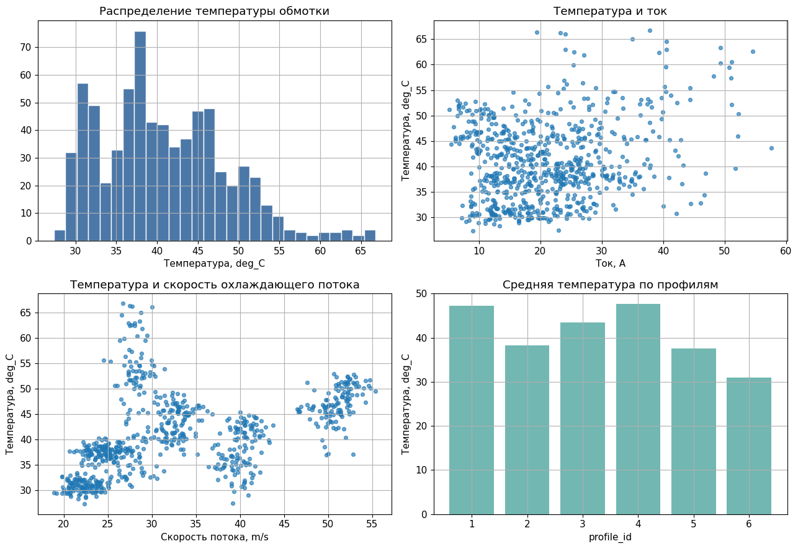
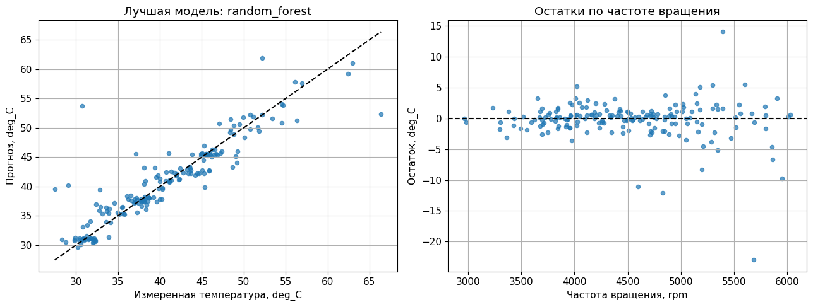

<!-- _class: title -->

# Занятие 4
## Прогноз температуры электропривода HAPS

Регрессия теплового режима, физически мотивированная модель,
случайный лес и градиентный бустинг.

---

## Цель занятия

Сформировать начальный навык построения моделей регрессии для прогноза
температуры обмотки электропривода высотной псевдоспутниковой платформы.

HAPS (High Altitude Platform Station) - высотная псевдоспутниковая
платформа длительного пребывания в стратосфере.

---

## Инженерная постановка

Целевая переменная:

$$
y = T_{winding},
$$

где $T_{winding}$ - температура обмотки двигателя.

Признаки:

1. высота и плотность воздуха;
2. температура окружающей среды;
3. скорость охлаждающего потока;
4. скорость, момент, напряжение и ток.

---

## Тепловая модель первого порядка

$$
T_{k+1} = T_k + \frac{\Delta t}{\tau}
\left(T_{amb,k} + R_{th} P_{loss,k} - T_k\right)
$$

Здесь $R_{th}$ - тепловое сопротивление, $\tau$ - тепловая постоянная
времени, $P_{loss}$ - суммарные потери.

Учебная физическая аппроксимация:

$$
P_{loss,proxy} = U I - M \omega.
$$

---

## Модели

1. Физически мотивированная линейная модель.
2. Ridge-регрессия - линейная модель с L2-регуляризацией.
3. Random Forest, случайный лес - ансамбль деревьев решений.
4. Gradient Boosting, градиентный бустинг - последовательное уточнение
   ошибки предыдущих деревьев.

---

## Структура данных

Feature-CSV:

`practice_04_haps_thermal_features.csv`

Diagnostics-CSV:

`practice_04_haps_thermal_diagnostics.csv`

Диагностические столбцы не включаются в базовую модель.

---

## Разведочный анализ

---

## Корреляционная структура

---

## Метрики регрессии

MAE (Mean Absolute Error) - средняя абсолютная ошибка.

RMSE (Root Mean Squared Error) - корень из средней квадратичной ошибки.

R2 - коэффициент детерминации, показывающий долю объясненной изменчивости.

Для температуры удобно интерпретировать MAE и RMSE в градусах Цельсия.

---

## Прогноз и остатки

---

## Важность признаков

---

<!-- _class: warning -->

## Антипример утечки данных

Не использовать в отчете как рабочую модель:

`steady_state_temp_c` - расчетная стационарная температура из скрытой
тепловой модели генератора.

Если включить этот столбец в признаки, качество модели будет завышено.

---

<!-- _class: checklist -->

## Критерии зачета

1. Загружены feature-CSV и diagnostics-CSV.
2. Построены графики разведочного анализа.
3. Обучены физическая модель, Ridge, Random Forest и Gradient Boosting.
4. Рассчитаны MAE, RMSE и R2.
5. Выполнена интерпретация важности признаков.
6. Объяснена утечка через диагностические столбцы.

---

## Контрольные вопросы

1. Почему температура имеет тепловую инерцию?
2. Чем случайный лес отличается от одного дерева?
3. Что исправляет градиентный бустинг?
4. Почему diagnostics-CSV нельзя использовать как обычные признаки?
5. Почему важность признака не равна физической причинности?
