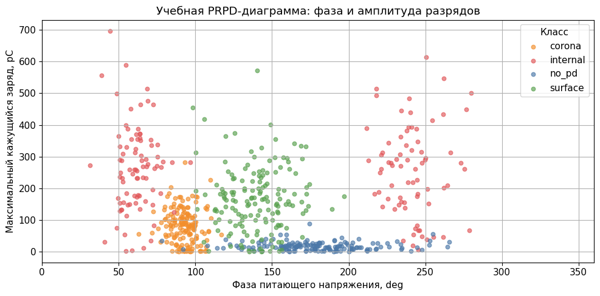
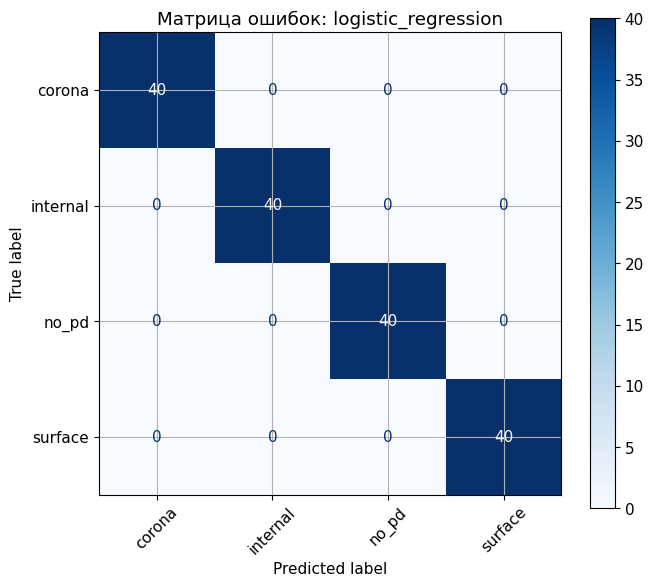
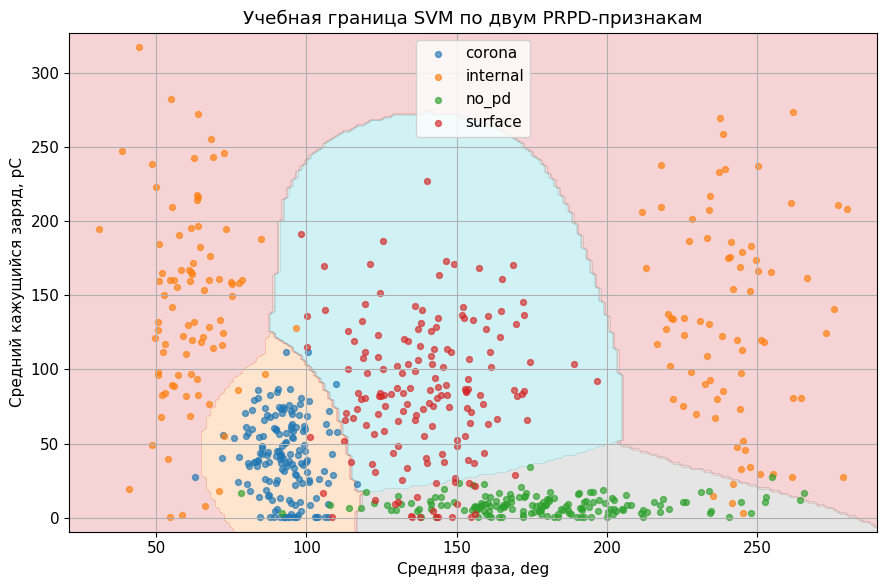
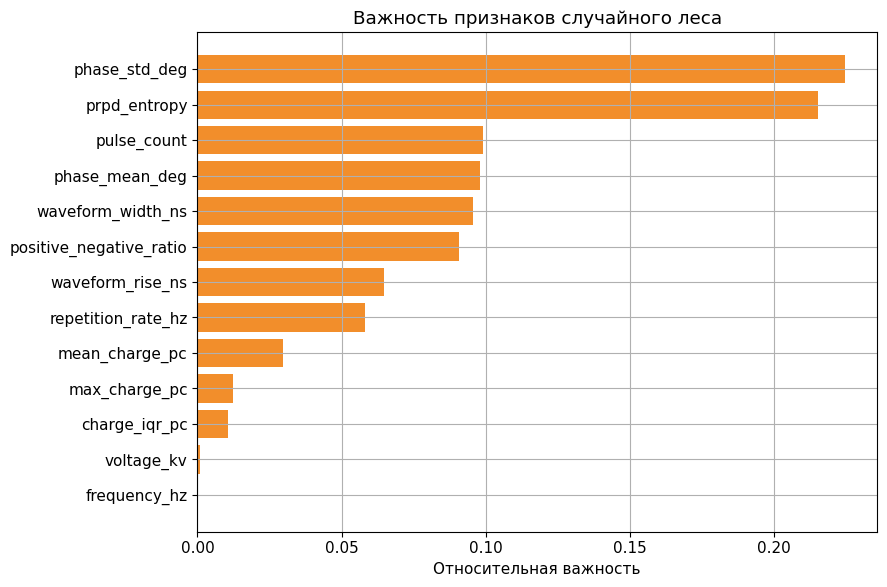

<!-- _class: title -->

# Занятие 5
## Классификация частичных разрядов

PRPD-признаки, SVM, случайный лес и диагностическая интерпретация.

<!--
Начать с инженерного смысла: модель не ставит окончательный диагноз
изоляции, а помогает выполнить предварительную классификацию по признакам
частичных разрядов. Это важно для предотвращения завышенных ожиданий от
машинного обучения.
-->

---

## Цель занятия

Научиться строить начальную диагностическую классификацию состояния
изоляции по признакам частичных разрядов.

Частичный разряд - локальный электрический разряд в части изоляционной
системы, не полностью перекрывающий изоляционный промежуток.

<!--
Пояснить отличие частичного разряда от полного пробоя. Частичный разряд
может быть ранним диагностическим признаком, но его интерпретация зависит
от измерительной цепи, фильтрации и условий испытания.
-->

---

## Распределение времени занятия

| Блок | Содержание | Время, мин |
|---|---|---:|
| 1 | Частичные разряды, PRPD и признаки | 15 |
| 2 | Масштабирование и структура данных | 15 |
| 3 | Обучение классификаторов и TODO | 35 |
| 4 | Матрица ошибок, SVM и антипример | 15 |
| 5 | Диагностический вывод и открытый источник | 10 |

<!--
Время на SVM ограничено: студенту достаточно изменить параметр C в
рекомендуемом диапазоне 0.1-10 и объяснить результат по macro-F1.
-->

---

<!-- _class: section -->

# Раздел 1
## PRPD-представление

---

## PRPD-представление

PRPD (Phase Resolved Partial Discharge) - фазово-разрешенное
представление частичных разрядов.

Оно связывает импульсы с фазой питающего напряжения и позволяет
анализировать:

1. фазовое положение импульсов;
2. кажущийся заряд;
3. повторяемость;
4. форму импульса;
5. симметрию положительной и отрицательной полуволны.

<!--
Обязательное пояснение: PRPD - это не просто scatter plot, а способ
связать импульсы разрядов с фазой питающего напряжения. Сырые сигналы
нужно предварительно преобразовать в признаки.
-->

---

## Учебная PRPD-диаграмма

Диаграмма связывает фазу питающего напряжения и амплитуду кажущегося
заряда.

<!--
Схема формирует физический образ задачи. Нужно подчеркнуть, что учебная
диаграмма агрегирует признаки, а реальный PRPD-анализ требует учета
частоты, фильтрации и калибровки.
-->

---

<!-- _class: section -->

# Раздел 2
## Модели классификации

---

## Модели классификации

1. Logistic Regression - логистическая регрессия.
2. Decision Tree - дерево решений.
3. Random Forest - случайный лес.
4. SVM linear - метод опорных векторов с линейным ядром.
5. SVM RBF - метод опорных векторов с радиальной базисной функцией.

SVM требует масштабирования признаков.

<!--
Здесь нужно объяснить слово "зазор" (margin): SVM ищет границу, которая
разделяет классы с максимальным расстоянием до ближайших объектов. Без
масштабирования расстояния искажаются.
-->

---

## Структура данных

Feature-CSV:

`practice_05_partial_discharge_features.csv`

Целевая переменная:

`defect_class`: `no_pd`, `corona`, `surface`, `internal`.

Diagnostics-CSV содержит `risk_score`, `defect_code` и служебные признаки.

<!--
Спросить студентов, почему risk_score нельзя использовать как признак.
Ожидаемый ответ: это производная диагностическая оценка, связанная с
правилом разметки, то есть источник утечки данных.
-->

---

<!-- _class: section -->

# Раздел 3
## Эксперименты и диагностическая интерпретация

---

## Распределение классов и PRPD-признаки

<!--
Баланс классов определяет, насколько допустимо ориентироваться на
accuracy. Даже при сбалансированном учебном наборе для отчета требуется
macro-F1, чтобы закрепить правильную диагностическую привычку.
-->

---

## Парные зависимости

<!--
Парные зависимости показывают только двумерные срезы многомерной задачи.
Нельзя делать вывод о полной разделимости классов только по одному графику.
-->

---

## Метрики

Accuracy - доля правильных ответов.

Precision - точность положительных прогнозов.

Recall - полнота, то есть доля найденных объектов класса.

F1 - гармоническое среднее precision и recall.

Macro-F1 усредняет F1 по классам без учета размера класса.

<!--
Дать студентам короткий ориентир: accuracy отвечает "сколько всего
правильно", macro-F1 отвечает "насколько равномерно модель работает по
классам".
-->

---

## Матрица ошибок

Матрица читается по строкам истинного класса и по столбцам прогноза.

<!--
Матрицу ошибок следует переводить в диагностический язык: какие дефекты
можно спутать и чем это опасно. Пропуск внутреннего дефекта обсуждается
строже, чем неверное разделение близких внешних проявлений.
-->

---

## Учебная граница SVM

SVM (Support Vector Machine) - метод опорных векторов. На схеме показана
только двумерная иллюстрация разделяющей поверхности.

<!--
Подчеркнуть, что эта граница построена по двум признакам для объяснения.
Основная модель использует больше признаков, поэтому рисунок не является
полным описанием классификатора.
-->

---

## Важность признаков

<!--
Важность признаков случайного леса полезна для первичной интерпретации,
но она зависит от корреляций и структуры учебной выборки. Ее нельзя
считать самостоятельным физическим доказательством.
-->

---

<!-- _class: warning -->

## Антипример утечки данных

Не использовать в отчете как рабочую модель:

`risk_score` - производная риск-оценка, связанная с правилом генерации
диагностического класса.

Такая переменная искусственно завышает качество классификации.

<!--
Антипример нужно произнести как методический запрет. Если студент
включает risk_score в признаки, он фактически использует ответ,
зашитый в диагностическую таблицу.
-->

---

<!-- _class: checklist -->

## Критерии зачета

1. Выполнено масштабирование признаков.
2. Обучены логистическая регрессия, дерево, случайный лес и два SVM.
3. Рассчитаны accuracy, macro-precision, macro-recall и macro-F1.
4. Построена матрица ошибок.
5. Сформулирован диагностический вывод.
6. Объяснена утечка через `risk_score`.

<!--
Критерий зачета требует не максимальной accuracy, а корректного
объяснения масштабирования, метрик по классам и диагностических ошибок.
-->

---

## Реестр открытых источников

Расширенное задание требует описать, какие признаки извлекаются из сырых
сигналов до классификации.

<!--
Студент должен понять, что внешний источник по частичным разрядам редко
имеет готовую таблицу PRPD-признаков. Обычно требуется предварительная
обработка временного сигнала и описание частоты дискретизации.
-->

---

## Контрольные вопросы

1. Что такое частичный разряд?
2. Что показывает PRPD-представление?
3. Почему SVM требует масштабирования?
4. Чем macro-F1 отличается от accuracy?
5. Почему результат модели не является окончательным диагнозом?

<!--
Контрольные вопросы фиксируют минимальный уровень понимания: студент
должен связать физический смысл PRPD с выбором модели и метрик.
-->
