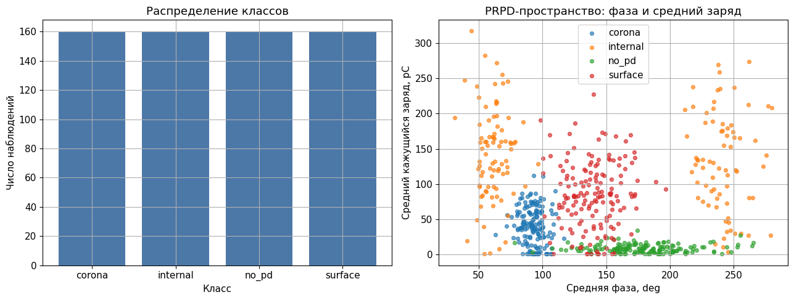
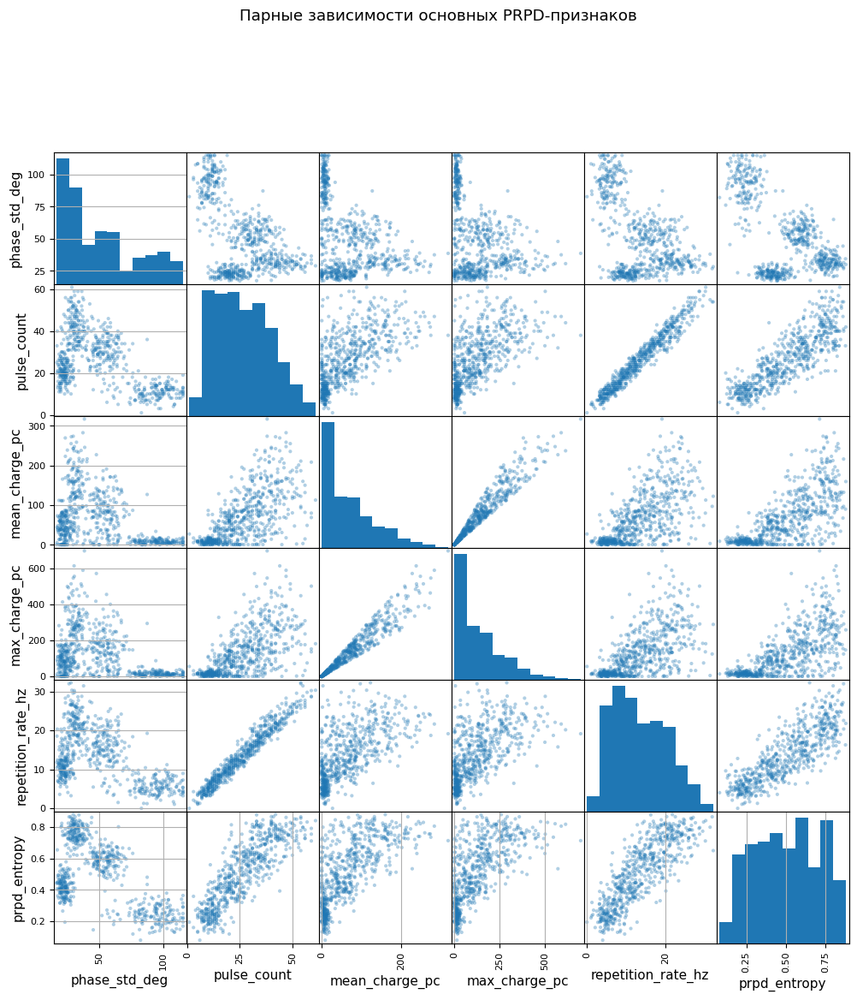

<!-- _class: title -->

# Занятие 5
## Классификация частичных разрядов

PRPD-признаки, SVM, случайный лес и диагностическая интерпретация.

---

## Цель занятия

Научиться строить начальную диагностическую классификацию состояния
изоляции по признакам частичных разрядов.

Частичный разряд - локальный электрический разряд в части изоляционной
системы, не полностью перекрывающий изоляционный промежуток.

---

## PRPD-представление

PRPD (Phase Resolved Partial Discharge) - фазово-разрешенное
представление частичных разрядов.

Оно связывает импульсы с фазой питающего напряжения и позволяет
анализировать:

1. фазовое положение импульсов;
2. кажущийся заряд;
3. повторяемость;
4. форму импульса;
5. симметрию положительной и отрицательной полуволны.

---

## Модели классификации

1. Logistic Regression - логистическая регрессия.
2. Decision Tree - дерево решений.
3. Random Forest - случайный лес.
4. SVM linear - метод опорных векторов с линейным ядром.
5. SVM RBF - метод опорных векторов с радиальной базисной функцией.

SVM требует масштабирования признаков.

---

## Структура данных

Feature-CSV:

`practice_05_partial_discharge_features.csv`

Целевая переменная:

`defect_class`: `no_pd`, `corona`, `surface`, `internal`.

Diagnostics-CSV содержит `risk_score`, `defect_code` и служебные признаки.

---

## Распределение классов и PRPD-признаки

---

## Парные зависимости

---

## Метрики

Accuracy - доля правильных ответов.

Precision - точность положительных прогнозов.

Recall - полнота, то есть доля найденных объектов класса.

F1 - гармоническое среднее precision и recall.

Macro-F1 усредняет F1 по классам без учета размера класса.

---

## Матрица ошибок

---

## Важность признаков

---

<!-- _class: warning -->

## Антипример утечки данных

Не использовать в отчете как рабочую модель:

`risk_score` - производная риск-оценка, связанная с правилом генерации
диагностического класса.

Такая переменная искусственно завышает качество классификации.

---

<!-- _class: checklist -->

## Критерии зачета

1. Выполнено масштабирование признаков.
2. Обучены логистическая регрессия, дерево, случайный лес и два SVM.
3. Рассчитаны accuracy, macro-precision, macro-recall и macro-F1.
4. Построена матрица ошибок.
5. Сформулирован диагностический вывод.
6. Объяснена утечка через `risk_score`.

---

## Контрольные вопросы

1. Что такое частичный разряд?
2. Что показывает PRPD-представление?
3. Почему SVM требует масштабирования?
4. Чем macro-F1 отличается от accuracy?
5. Почему результат модели не является окончательным диагнозом?
