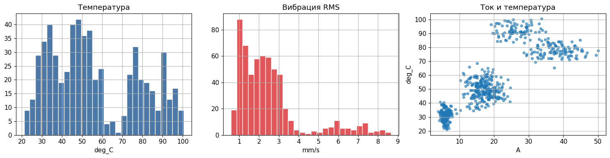
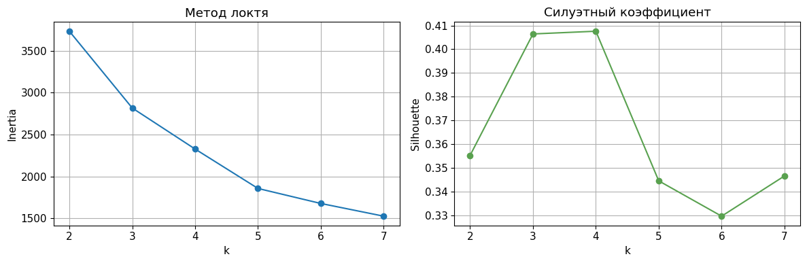

<!-- _class: title -->

# Занятие 6
## Кластеризация режимов оборудования

Обучение без учителя, PCA, k-means, DBSCAN и Gaussian Mixture.

---

## Цель занятия

Научиться группировать режимы оборудования по сенсорным признакам без
использования целевой переменной.

Обучение без учителя (unsupervised learning) - обучение, при котором
алгоритм не получает заранее заданные классы.

---

## Основные методы

k-means - метод k-средних, минимизирующий расстояния объектов до центров
кластеров.

DBSCAN - плотностной алгоритм, который выделяет плотные области и шум.

Gaussian Mixture - гауссова смесь, вероятностное описание данных как смеси
нормальных распределений.

PCA - метод главных компонент для визуализации многомерных данных.

---

## Структура данных

Feature-CSV:

`practice_06_equipment_modes_features.csv`

Diagnostics-CSV:

`practice_06_equipment_modes_diagnostics.csv`

Диагностическая разметка применяется только после кластеризации.

---

## Разведочный анализ

---

## PCA-проекция

---

## Силуэтный коэффициент

Silhouette score - коэффициент, который оценивает, насколько объект ближе
к своему кластеру, чем к соседним кластерам.

Значения ближе к 1 соответствуют более отделенным кластерам, значения
около 0 указывают на перекрытие групп.

---

## Выбор числа кластеров

---

## Сравнение алгоритмов

---

## Интерпретация кластеров

После обучения можно присоединить diagnostics-CSV и проверить:

1. какие скрытые режимы попали в каждый кластер;
2. какие кластеры связаны с вибрацией;
3. какие кластеры связаны с ухудшением охлаждения;
4. какие режимы требуют дополнительной диагностики.

---

<!-- _class: warning -->

## Антипример

Не использовать в обучении:

1. `true_mode_label`;
2. `mode_id`;
3. `anomaly_flag`;
4. `health_score`.

Иначе кластеризация превращается в скрытую классификацию.

---

<!-- _class: checklist -->

## Критерии зачета

1. Признаки масштабированы.
2. Выполнен PCA-анализ.
3. Построены k-means, DBSCAN и Gaussian Mixture.
4. Рассчитан силуэтный коэффициент.
5. Выбрано и обосновано число кластеров.
6. Дана инженерная интерпретация 2-3 кластеров.

---

## Контрольные вопросы

1. Чем кластеризация отличается от классификации?
2. Зачем требуется масштабирование?
3. Что показывает PCA?
4. Почему число кластеров должно иметь инженерное обоснование?
5. Можно ли считать кластер окончательным техническим диагнозом?
