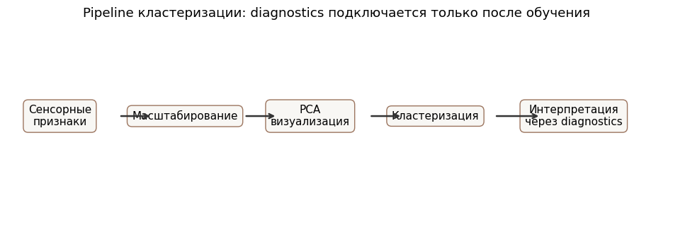
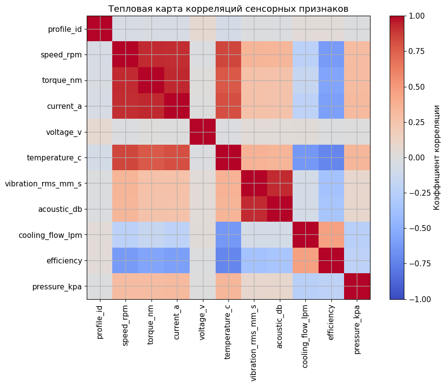
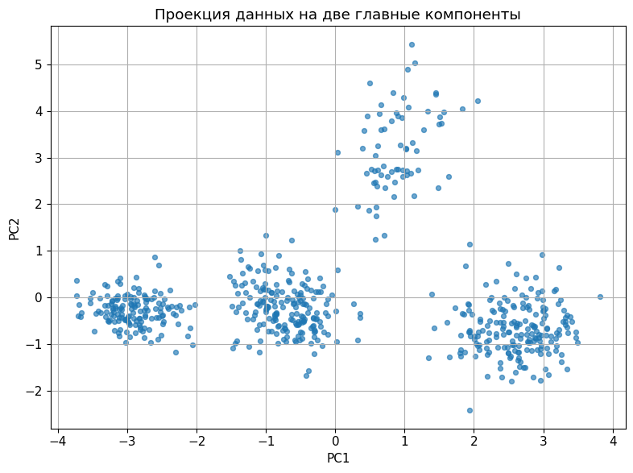
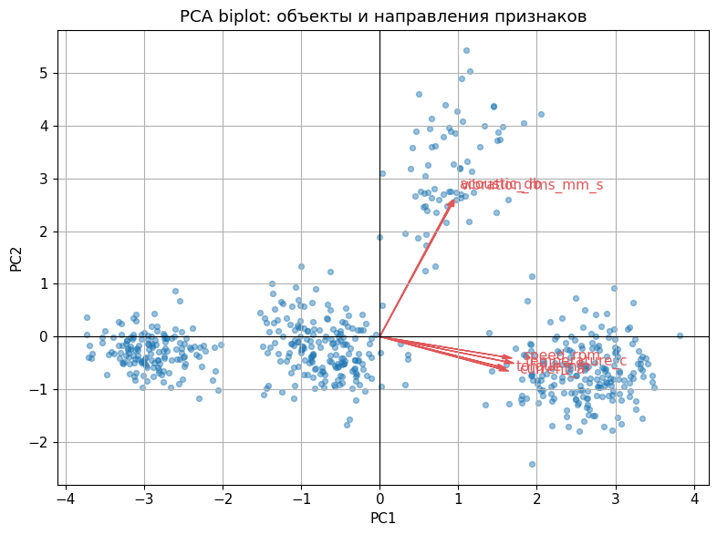
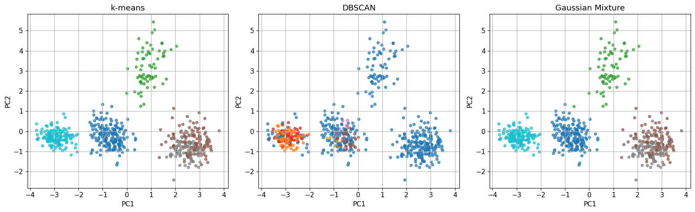
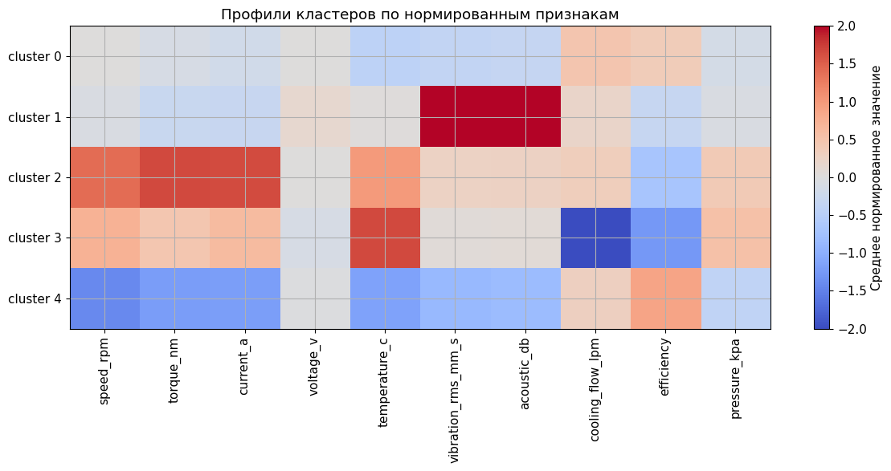

<!-- _class: title -->

# Занятие 6
## Кластеризация режимов оборудования

Обучение без учителя, PCA, k-means, DBSCAN и Gaussian Mixture.

<!--
Начать с принципиального отличия от занятий 2-5: здесь при обучении нет
целевой переменной. Преподаватель должен сразу запретить использовать
diagnostics-CSV до этапа интерпретации кластеров.
-->

---

## Цель занятия

Научиться группировать режимы оборудования по сенсорным признакам без
использования целевой переменной.

Обучение без учителя (unsupervised learning) - обучение, при котором
алгоритм не получает заранее заданные классы.

<!--
Цель занятия - не "угадать режим", а найти группы сходных наблюдений и
дать им инженерное описание. Это снижает риск подмены кластеризации
классификацией.
-->

---

## Распределение времени занятия

| Блок | Содержание | Время, мин |
|---|---|---:|
| 1 | Обучение без учителя и структура данных | 15 |
| 2 | Масштабирование, корреляции и PCA | 15 |
| 3 | k-means, DBSCAN, GMM и TODO | 35 |
| 4 | Профили кластеров и антипример | 15 |
| 5 | Вывод и расширение на UCI AI4I | 10 |

<!--
При нехватке времени преподаватель сокращает перебор параметров DBSCAN и
оставляет один рекомендуемый eps, но обязательно сохраняет этап
интерпретации профилей кластеров.
-->

---

<!-- _class: section -->

# Раздел 1
## Обучение без учителя

---

## Основные методы

k-means - метод k-средних, минимизирующий расстояния объектов до центров
кластеров.

DBSCAN - плотностной алгоритм, который выделяет плотные области и шум.

Gaussian Mixture - гауссова смесь, вероятностное описание данных как смеси
нормальных распределений.

PCA - метод главных компонент для визуализации многомерных данных.

<!--
Каждый метод объясняется на уровне начального курса: k-means ищет центры,
DBSCAN ищет плотные области и шум, Gaussian Mixture задает вероятностную
смесь, PCA помогает увидеть многомерные данные на плоскости.
-->

---

## Структура данных

Feature-CSV:

`practice_06_equipment_modes_features.csv`

Diagnostics-CSV:

`practice_06_equipment_modes_diagnostics.csv`

Диагностическая разметка применяется только после кластеризации.

<!--
Это центральный слайд занятия. Попросить студентов назвать два столбца,
которые нельзя использовать в признаках: например true_mode_label и
anomaly_flag.
-->

---

<!-- _class: section -->

# Раздел 2
## Подготовка признаков и PCA

---

## Последовательность кластеризации

Diagnostics-CSV подключается только на этапе интерпретации найденных
кластеров.

<!--
Схема фиксирует порядок работы. Любое использование diagnostics до
алгоритма должно трактоваться как методическая ошибка и скрытая
классификация.
-->

---

## Разведочный анализ

<!--
Разведочный анализ нужен не для выбора "истинного" числа кластеров, а для
понимания диапазонов, пропусков и явных связанных величин.
-->

---

## Корреляции признаков

<!--
Корреляции влияют на расстояния и важны для интерпретации PCA. При этом
корреляция не доказывает физическую причинность.
-->

---

## PCA-проекция

<!--
PCA-проекция показывает возможную геометрию групп, но сама по себе не
является кластеризацией и не доказывает число режимов.
-->

---

## PCA biplot

Biplot показывает одновременно точки наблюдений и направления признаков
в пространстве главных компонент.

<!--
Пояснить, что стрелки biplot отражают направления признаков в координатах
главных компонент. Это визуальная подсказка для именования кластеров.
-->

---

<!-- _class: section -->

# Раздел 3
## Кластеризация и интерпретация

---

## Силуэтный коэффициент

Silhouette score - коэффициент, который оценивает, насколько объект ближе
к своему кластеру, чем к соседним кластерам.

Значения ближе к 1 соответствуют более отделенным кластерам, значения
около 0 указывают на перекрытие групп.

<!--
Силуэтный коэффициент удобен, но не является единственным критерием.
Число кластеров должно иметь инженерное объяснение через профили
признаков.
-->

---

## Выбор числа кластеров

<!--
На этом слайде студент должен выбрать рациональный диапазон k, а не
механически максимизировать один показатель.
-->

---

## Сравнение алгоритмов

DBSCAN-метка `-1` означает шум, а не отдельный технический режим.

<!--
Разобрать, что слишком много шумовых точек может означать неподходящий
eps или неоднородную структуру данных.
-->

---

## Профили кластеров

<!--
Профили кластеров - основной инструмент инженерной интерпретации. Студент
должен назвать 2-3 группы через признаки: высокая нагрузка, вибрационная
тревога, ухудшенное охлаждение.
-->

---

## Интерпретация кластеров

После обучения можно присоединить diagnostics-CSV и проверить:

1. какие скрытые режимы попали в каждый кластер;
2. какие кластеры связаны с вибрацией;
3. какие кластеры связаны с ухудшением охлаждения;
4. какие режимы требуют дополнительной диагностики.

<!--
Diagnostics присоединяется только здесь. Это не нарушение, если данные
используются для проверки смысла кластеров после обучения.
-->

---

<!-- _class: warning -->

## Антипример

Не использовать в обучении:

1. `true_mode_label`;
2. `mode_id`;
3. `anomaly_flag`;
4. `health_score`.

Иначе кластеризация превращается в скрытую классификацию.

<!--
Антипример должен быть явно отделен от рабочей модели. Его цель -
показать, как легко получить высокий ARI, если подмешать диагностическую
разметку в признаки.
-->

---

<!-- _class: checklist -->

## Критерии зачета

1. Признаки масштабированы.
2. Выполнен PCA-анализ.
3. Построены k-means, DBSCAN и Gaussian Mixture.
4. Рассчитан силуэтный коэффициент.
5. Выбрано и обосновано число кластеров.
6. Дана инженерная интерпретация 2-3 кластеров.

<!--
Зачет выставляется за корректный процесс: масштабирование, выбор
признаков, сравнение методов, интерпретацию. Совпадение с скрытой
разметкой не является единственным критерием.
-->

---

## Реестр открытых источников

Для UCI AI4I 2020 требуется отделить сенсорные признаки от служебных
кодов и признаков отказа.

<!--
Этот слайд задает индивидуальное расширенное задание: студент описывает,
какие столбцы можно использовать до кластеризации, а какие допустимы
только после обучения для интерпретации групп.
-->

---

## Контрольные вопросы

1. Чем кластеризация отличается от классификации?
2. Зачем требуется масштабирование?
3. Что показывает PCA?
4. Почему число кластеров должно иметь инженерное обоснование?
5. Можно ли считать кластер окончательным техническим диагнозом?

<!--
Контрольные вопросы удобно задавать устно. Студент должен показать, что
понимает различие между найденной группой наблюдений и окончательным
техническим диагнозом.
-->
